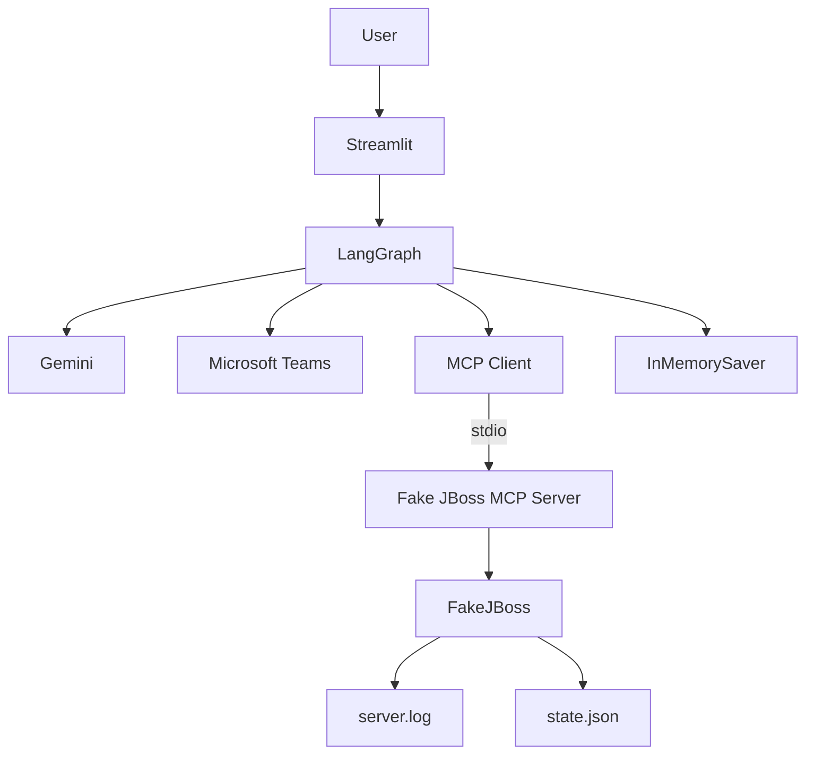
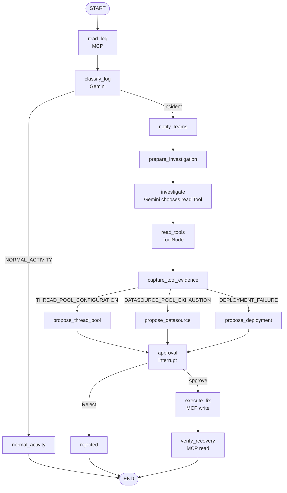

# JBoss Incident Response Agent

JBoss EAP の障害一次対応を題材に、**LangGraph / Gemini / MCP / ToolNode / Human-in-the-loop / Microsoft Teams** を組み合わせた学習用デモアプリケーションです。

実際の JBoss を直接操作するのではなく、`FakeJBoss` が `server.log` とサーバー状態をファイル上で模擬します。Agent はその疑似環境を MCP 経由で調査し、必要な復旧操作を提案します。JBoss の状態変更は Human-in-the-loop の承認後にだけ実行されます。

## アプリケーションの目的

このアプリでは、Agent が次の流れで JBoss 障害へ対応します。

1. MCP で `server.log` を取得する
2. Gemini がログを分類する
3. 障害なら Microsoft Teams へ通知する
4. Gemini 自身が、追加調査に使う read-only MCP Tool を選ぶ
5. LangGraph の `ToolNode` が選ばれた Tool を実行する
6. 調査結果と障害種別から対処案を作る
7. `interrupt()` でユーザー承認を待つ
8. Approve の場合だけ MCP write Tool を実行する
9. MCP read Tool でもう一度状態を確認し、復旧できたか判定する

正常ログの場合は Teams 通知・追加調査・Human-in-the-loop・write Tool を呼ばず終了します。

---

## 全体構成



主な役割は次の通りです。

| コンポーネント | 役割 |
|---|---|
| Streamlit | シナリオ投入、Agent 実行、Approve / Reject、結果表示 |
| LangGraph | Node / Edge / State による処理制御 |
| Gemini | ログ分類と read Tool の選択 |
| ToolNode | Gemini が生成した Tool Call の実行 |
| MCP | Fake JBoss の read / write 操作を Tool として公開 |
| Teams Node | 障害検知結果を Teams へ送信 |
| Human-in-the-loop | JBoss の変更操作を人が承認・拒否 |
| InMemorySaver | `interrupt()` からの再開に必要な Checkpoint 保存 |
| FakeJBoss | 疑似 server.log と疑似 JBoss 状態の保持 |

---

## LangGraph の処理フロー



### LLM に任せる部分

Gemini は 2 箇所で利用します。

**ログ分類**

`server.log` から以下のいずれかを返します。

- `THREAD_POOL_CONFIGURATION`
- `DATASOURCE_POOL_EXHAUSTION`
- `DEPLOYMENT_FAILURE`
- `NORMAL_ACTIVITY`

**追加調査 Tool の選択**

障害の場合、Gemini に read-only MCP Tool を bind します。

- `get_thread_pool_status`
- `get_datasource_status`
- `get_deployment_status`

Gemini は障害分類・ログ・Tool の description を見て、調査に使う Tool を 1 つ選びます。

### Python / LangGraph が固定している部分

次は LLM に自由判断させません。

- Teams 通知を行うかどうか
- write Tool の種類と引数
- Human approval を必須にすること
- Approve / Reject 後の分岐
- 復旧確認条件

これにより、LLM の推論とアプリケーション制御の境界を明確にしています。

---

## ToolNode と MCP

最初の `read_server_log` は Graph の入口で固定実行します。

その後の詳細調査では、Gemini 自身が read Tool を選びます。

```text
prepare_investigation
        ↓
HumanMessage
        ↓
investigate
        ↓
Gemini + bind_tools(read-only MCP Tools)
        ↓
AIMessage(tool_calls=[...])
        ↓
ToolNode
        ↓
MCP Tool 実行
        ↓
ToolMessage
        ↓
capture_tool_evidence
```

`ToolNode` に渡しているのは read Tool だけです。write Tool は Gemini に bind せず、Human approval 後の `execute_fix` Node から Python が明示的に実行します。

### MCP read Tool

| Tool | 内容 |
|---|---|
| `read_server_log` | 疑似 `server.log` を読む |
| `get_thread_pool_status` | Thread Pool 状態を読む |
| `get_datasource_status` | Datasource Pool 状態を読む |
| `get_deployment_status` | Deployment 状態を読む |

### MCP write Tool

| Tool | 内容 |
|---|---|
| `set_thread_pool_max_threads` | Thread Pool 上限を変更 |
| `set_datasource_max_pool_size` | Datasource Pool 上限を変更 |
| `restart_deployment` | Deployment を再起動 |

MCP Server は別 Python プロセスとして起動し、LangGraph 側とは stdio で通信します。

---

## Microsoft Teams 通知

Gemini が正常以外の category を返した場合、`notify_teams` Node を通ります。

Teams 通知は MCP Tool ではなく、通常の Python Node として実装しています。

送信内容は次の程度です。

```text
[JBoss Incident Detected]
Server: jboss-01
Category: THREAD_POOL_CONFIGURATION
Summary: ...
```

既定値では `TEAMS_DRY_RUN=true` なので実際のネットワーク送信は行わず、送信予定 payload を State に保存します。

実送信する場合は `.env` に設定します。

```env
TEAMS_DRY_RUN=false
TEAMS_WEBHOOK_URL=https://...
```

---

## Human-in-the-loop

対処案が作られると `approval` Node で次を実行します。

```python
decision = interrupt({...})
```

この時点で Graph は中断し、State は Checkpointer に保存されます。

Approve の場合は同じ `thread_id` で次のように再開します。

```python
Command(resume=True)
```

Reject の場合は `Command(resume=False)` で再開し、write Tool は実行せず終了します。

このデモでは `InMemorySaver` を利用しているため、アプリプロセスを再起動すると Checkpoint は消えます。

---

## AgentState

主な State は次の通りです。

| Key | 内容 |
|---|---|
| `server_id` | 対象サーバー |
| `log_lines` | MCP で取得した server.log |
| `category` | Gemini の障害分類 |
| `summary` | 分類理由 |
| `messages` | ToolNode 用の Human / AI / Tool Message 履歴 |
| `selected_read_tools` | Gemini が選択した read Tool |
| `evidence` | MCP read Tool の結果と復旧確認結果 |
| `teams_result` | Teams 通知結果 |
| `proposed_action` | Python が作る固定対処案 |
| `approved` | Human approval の結果 |
| `execution_result` | MCP write Tool の結果 |
| `recovered` | 復旧確認結果 |
| `status` | 最終状態 |
| `trace` | 通過した Node の順序 |

画面では `selected_read_tools` と `trace` を確認できるため、Gemini がどの Tool を選び、Graph がどの Node を通ったかを追跡できます。

---

## 疑似障害シナリオ

| Scenario | 疑似状態 | 対処 |
|---|---|---|
| `THREAD_POOL_CONFIGURATION` | `max_threads=20`, queue 発生 | `max_threads=80` |
| `DATASOURCE_POOL_EXHAUSTION` | `max_pool_size=5`, timeout 発生 | `max_pool_size=30` |
| `DEPLOYMENT_FAILURE` | `app.war=FAILED` | `restart_deployment` |
| `NORMAL_ACTIVITY` | 正常ログ・正常状態 | 変更なし |

Fake JBoss は `.data/fake_jboss/` に状態を保存します。

```text
.data/fake_jboss/
├── server.log
└── state.json
```

---

## ディレクトリ構成

```text
.
├── app.py
├── README.md
├── Dockerfile
├── Makefile
├── pyproject.toml
├── .env.example
├── docs/
│   └── LEARNING_GUIDE.md
├── src/jboss_agent/
│   ├── config.py
│   ├── fake_jboss.py
│   ├── graph.py
│   ├── teams.py
│   └── mcp/
│       ├── client.py
│       └── server.py
└── tests/
    ├── test_fake_jboss.py
    ├── test_graph.py
    ├── test_mcp.py
    └── test_teams.py
```

---

## 実行方法

前提:

- Docker Desktop
- VS Code
- Dev Containers
- Gemini API Key

`.env` を作成します。

```bash
cp .env.example .env
```

Windows PowerShell:

```powershell
Copy-Item .env.example .env
```

`.env` に Gemini API Key を設定します。

```env
GOOGLE_API_KEY=your-api-key
```

各ステップ後の State 全体と、ノード名・更新内容をターミナルに出力する場合は、
`.env` に以下を追加します。未設定または `false` の場合は出力しません。

```env
LANGGRAPH_DEBUG=true
```

開始時と承認・拒否後の再開時の両方に適用されます。設定変更後はアプリを再起動してください。

VS Code で `Dev Containers: Reopen in Container` を実行後、アプリを起動します。

```bash
make app
```

ブラウザ:

```text
http://localhost:8501
```

テストと lint:

```bash
make check
```

---

## テスト範囲

GitHub Actions でも `ruff check .` と `pytest -q` を実行します。

主な確認内容:

- 3 種類の疑似障害の復旧
- Gemini category による正常 / 障害分岐
- Gemini が生成した Tool Call を `ToolNode` が実行すること
- 選択された read Tool だけが呼ばれること
- 正常系では Teams / ToolNode / HITL を通らないこと
- 障害系では Teams Node を通ること
- `interrupt()` 前に write Tool が実行されないこと
- `Command(resume=True)` で write Tool が実行されること
- Reject では write Tool が実行されないこと
- stdio MCP Server の実 Tool 呼び出し
- Teams dry-run / URL 未設定時の動作

詳細な Node / State / ToolMessage の流れは [`docs/LEARNING_GUIDE.md`](docs/LEARNING_GUIDE.md) を参照してください。
