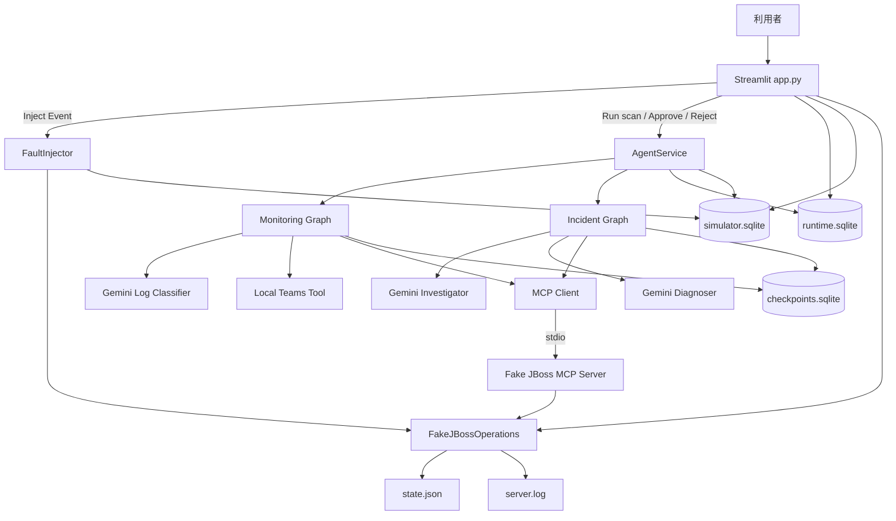
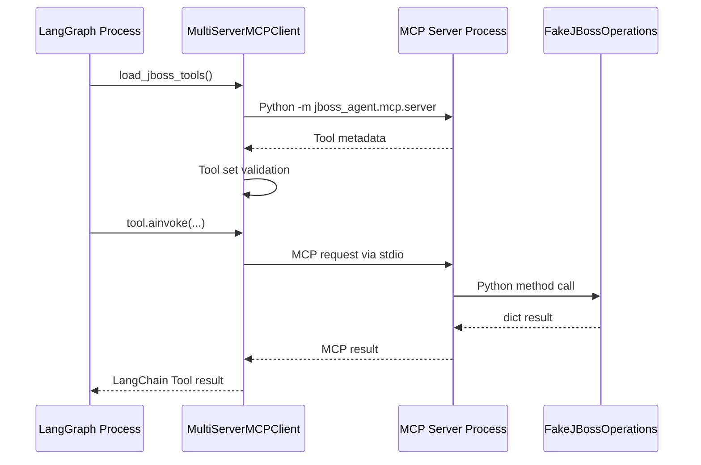
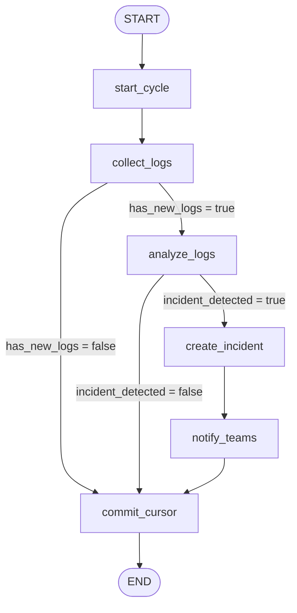
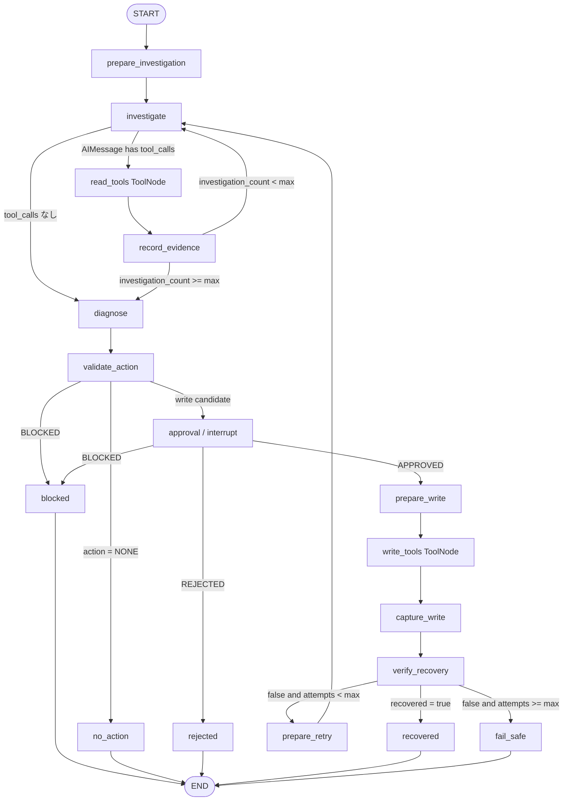
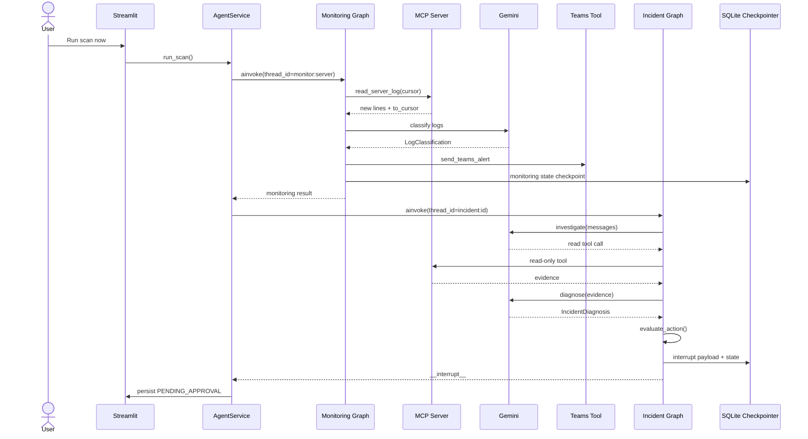
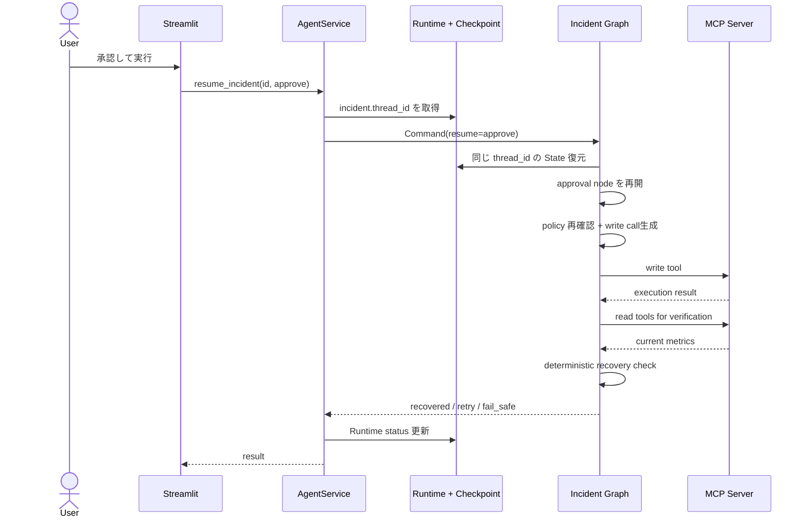
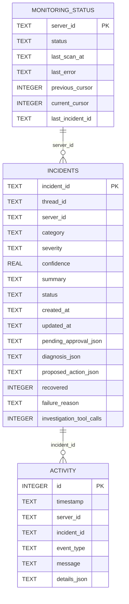
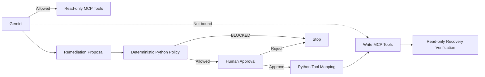

# JBoss Incident Response Agent 詳細設計書

> 対象: `jboss-agent-prod` の現行実装  
> 目的: README よりも実装に近い粒度で、構成要素・責務・データ・処理フロー・安全境界・永続化方式を説明する。

---

## 1. 文書の位置づけ

このアプリケーションは、JBoss EAP の障害一次対応を題材に、以下を組み合わせた学習用デモである。

- Streamlit: 操作画面
- LangGraph: 監視と障害対応のワークフロー制御
- Gemini: ログ分類、追加調査方針、原因診断、対処案生成
- MCP: JBoss の読み取り・書き込み Capability の公開
- Human-in-the-loop: 書き込み操作の最終承認
- SQLite: LangGraph の Checkpoint、画面表示用 Runtime 情報、シミュレーターの Ground Truth
- File-backed Fake JBoss: 実 JBoss の代わりとなる疑似状態・疑似 `server.log`

本デモでは「Agent が勝手にサーバー設定を書き換える」構造を避けるため、**LLM に渡す Tool と実際に書き込み可能な Tool を分離**し、書き込みは Python の固定ルールと人間の承認を通過した場合だけ実行する。

---

## 2. システム全体像



### 2.1 重要な設計思想

1. **監視と障害対応を別 Graph に分割する**  
   Monitoring Graph はログ差分の取得・分類・通知まで、Incident Graph は調査・診断・承認・復旧までを担当する。

2. **LLM と決定論的ロジックを分離する**  
   LLM は意味判断や調査方針を担当する。一方、危険な操作の許可範囲、write Tool の選択、復旧判定、試行上限は Python が決める。

3. **read Tool と write Tool を分離する**  
   Gemini Investigator には read-only Tool だけを bind する。write Tool は承認後に Python が Tool 名と引数を決定する。

4. **Human-in-the-loop は `interrupt()` + Checkpointer で実現する**  
   承認待ちの間に Python の実行スレッドを保持するのではなく、State を SQLite に保存して処理を終了し、後から同じ `thread_id` で再開する。

5. **Ground Truth を Agent から隔離する**  
   障害シナリオの正解は `simulator.sqlite` に保存し、Agent のプロンプトや State には渡さない。

---

## 3. ディレクトリ / モジュール構成

| パス | 主な責務 |
|---|---|
| `app.py` | Streamlit UI、イベント投入、監視実行、承認操作、一覧・履歴表示 |
| `src/jboss_agent/service.py` | UI と 2 本の LangGraph、RuntimeStore、GroundTruthStore のオーケストレーション |
| `src/jboss_agent/graphs/state.py` | `MonitoringState` / `IncidentState` の型定義 |
| `src/jboss_agent/graphs/monitoring.py` | Monitoring Graph の Node / Edge / Conditional Edge |
| `src/jboss_agent/graphs/incident.py` | Incident Graph の調査ループ、HITL、書き込み、復旧確認 |
| `src/jboss_agent/graphs/prompts.py` | ログ分類、調査、診断用 Prompt |
| `src/jboss_agent/llm.py` | Gemini クライアント、Structured Output、read Tool bind |
| `src/jboss_agent/models.py` | LLM 出力・承認入力の Pydantic Schema |
| `src/jboss_agent/policy.py` | LLM を使わない固定 Risk Policy |
| `src/jboss_agent/mcp/client.py` | MCP Server 起動、Tool 一覧検証、read/write 分離 |
| `src/jboss_agent/mcp/server.py` | Fake JBoss Capability を MCP Tool として公開 |
| `src/jboss_agent/fake_jboss.py` | 疑似 JBoss の状態・ログ・read/write 操作 |
| `src/jboss_agent/simulator.py` | 疑似障害投入、Ground Truth 保存 |
| `src/jboss_agent/teams.py` | Teams 通知用のローカル LangChain Tool |
| `src/jboss_agent/persistence.py` | LangGraph SQLite Checkpointer |
| `src/jboss_agent/runtime_store.py` | UI 表示用 SQLite DB |
| `src/jboss_agent/tool_results.py` | Tool 応答の正規化 |
| `tests/` | Graph、Policy、Simulator、RuntimeStore 等の単体テスト |

---

## 4. コンポーネント責務

### 4.1 Streamlit `app.py`

Streamlit は画面操作のたびにスクリプトを上から再実行する。そのため、処理継続に必要な本質的な情報を `st.session_state` だけには置かず、Runtime DB / Checkpoint DB / Simulator DB から読み直す構造になっている。

主な UI 機能:

- Fake JBoss の現在状態表示
- Monitoring 状態表示
- `Run scan now`
- `Inject Random Event`
- 特定シナリオ投入
- 承認 / 拒否 / 値編集後の承認
- Incident 一覧
- Ground Truth との答え合わせ
- Activity Timeline

`app.py` 自体は Graph の詳細ロジックを持たず、実行処理は `AgentService` に委譲する。

### 4.2 `AgentService`

`AgentService` は UI と Graph の境界に位置する Application Service である。

主な責務:

- MCP Tool のロード
- Checkpointer の開始
- Monitoring Graph の構築・実行
- Incident 検知時の Incident レコード作成
- Incident Graph の構築・実行
- `thread_id` の決定
- `interrupt()` の結果を RuntimeStore に保存
- 人間の判断を `Command(resume=...)` で Graph に戻す
- Graph State を UI 表示用 Status に変換
- Activity Timeline の記録

### 4.3 Gemini

Gemini は用途別に 3 種類の呼ばれ方をする。

| 用途 | 構成 | 主な出力 |
|---|---|---|
| ログ分類 | Structured Output | `LogClassification` |
| 追加調査 | read-only MCP Tool を bind | `AIMessage` + Tool Calls |
| 診断 | Structured Output | `IncidentDiagnosis` |

Structured Output は JSON Schema をモデルへ渡したうえで、Graph 側でも Pydantic による検証を行う。

### 4.4 MCP

MCP Server は別 Python プロセスとして `stdio` で起動する。



### 4.5 Fake JBoss

Fake JBoss は実 JBoss の代替であり、状態を以下のファイルに保存する。

- `.data/fake_jboss/state.json`
- `.data/fake_jboss/server.log`

UI プロセスと MCP Server プロセスの双方が同じファイルを参照できるため、別プロセスであっても疑似サーバー状態を共有できる。

---

## 5. MCP Tool 設計

### 5.1 read-only Tool

以下だけが Gemini Investigator に渡される。

| Tool | 用途 |
|---|---|
| `read_server_log` | byte cursor 以降のログ差分取得 |
| `get_server_health` | UP/DOWN、CPU、Heap、エラー率 |
| `get_thread_pool_status` | thread pool の使用数、上限、queue、reject |
| `get_datasource_status` | datasource pool の使用数、上限、timeout |
| `get_deployment_status` | deployment の状態 |
| `get_recent_config_changes` | 最近の設定変更履歴 |

### 5.2 write Tool

以下は Gemini Investigator に bind しない。

| Tool | 用途 |
|---|---|
| `set_thread_pool_max_threads` | thread pool 上限変更 |
| `set_datasource_max_pool_size` | datasource 上限変更 |
| `restart_deployment` | deployment 再起動 |
| `reload_server` | サーバー reload |

### 5.3 Tool Set の検証

`mcp/client.py` は MCP Server が公開した Tool を起動時に検証する。

- 必須 Tool が欠けていればエラー
- 想定外 Tool があればエラー
- `execute_jboss_cli` / `execute_shell` のような汎用実行 Tool があればエラー

これにより、MCP Server 側の変更によって Agent の権限が意図せず広がることを防ぐ。

---

## 6. Monitoring Graph 詳細

### 6.1 目的

`server.log` の前回読取位置からの差分だけを確認し、必要な場合だけ Gemini を呼び、障害と判断した場合は Incident ID を払い出して Teams 通知する。

### 6.2 Graph



### 6.3 Node の責務

| Node | 主な処理 |
|---|---|
| `start_cycle` | 前回サイクルの分類・通知結果を初期化 |
| `collect_logs` | MCP `read_server_log` を呼び、byte cursor 以降を取得 |
| `analyze_logs` | Gemini Structured Output でログ分類 |
| `create_incident` | `inc-xxxxxxxxxx` を生成し severity を設定 |
| `notify_teams` | ローカル Teams Tool を実行 |
| `commit_cursor` | `current_log_cursor` を `previous_log_cursor` へ確定 |

### 6.4 ログ cursor

cursor は行番号ではなく **UTF-8 ファイルの byte offset** である。

- `previous_log_cursor`: 前回確定した次回開始位置
- `scan_from_cursor`: 今回実際に読み始めた位置
- `current_log_cursor`: 今回読み終えた位置

ログファイルが小さくなり、保存済み cursor が末尾を超えた場合に限り、`collect_logs` は cursor `0` から一度だけ読み直し、`cursor_reset_detected=True` とする。

### 6.5 Gemini Skip

新しいログ行がない場合は `collect_logs -> commit_cursor -> END` となり、`analyze_logs` は呼ばれない。

この挙動により、監視を繰り返しても同じログを毎回 Gemini に投げない。

### 6.6 Severity

Incident 検知時の severity は固定ルールで決まる。

- `category != UNKNOWN` かつ `confidence >= 0.85` → `HIGH`
- それ以外 → `MEDIUM`

---

## 7. Incident Graph 詳細

### 7.1 目的

検知済み Incident に対し、read-only の追加調査、構造化診断、安全性検証、人間承認、write Tool、復旧確認を順番に実施する。

### 7.2 Graph



### 7.3 調査 Loop

`investigate` は Gemini に現在の Message 履歴を渡す。

Gemini が Tool Call を返した場合:

1. `read_tools` ToolNode が実行
2. ToolMessage が `messages` に追加
3. `record_evidence` が直近 ToolMessage を `evidence` に転記
4. `max_investigation_rounds` 未満なら再度 `investigate`
5. 上限に達した場合は `diagnose`

調査回数は Tool 数ではなく、Gemini Investigator の呼び出し回数 `investigation_count` で管理する。

### 7.4 診断

Diagnoser は以下を `IncidentDiagnosis` として返す。

- `root_cause`
- `confidence`
- `reason`
- `recommended_action`

推奨 Action:

- `NONE`
- `SET_THREAD_POOL_MAX_THREADS`
- `SET_DATASOURCE_MAX_POOL_SIZE`
- `RESTART_DEPLOYMENT`
- `RELOAD_SERVER`

### 7.5 Risk Policy

`policy.py` は LLM を使わず、固定ルールで評価する。

| Action | 条件 | Risk |
|---|---|---|
| `NONE` | 常に | LOW |
| `SET_THREAD_POOL_MAX_THREADS` | `proposed_value` が int かつ 1〜200 | MEDIUM |
| `SET_DATASOURCE_MAX_POOL_SIZE` | `proposed_value` が int かつ 1〜200 | MEDIUM |
| `RESTART_DEPLOYMENT` | deployment 名が空でない | HIGH |
| `RELOAD_SERVER` | 既知 Action | HIGH |
| 不明 / 欠損 / 範囲外 | - | BLOCKED |

`LOW` の `NONE` は書き込み不要としてそのまま正常終了する。その他の許可された書き込み候補は Human Approval に進む。

### 7.6 Human-in-the-loop

承認 Node では `interrupt(payload)` を呼ぶ。

Payload には以下が含まれる。

- `incident_id`
- `server_id`
- `action`
- `current_value`
- `proposed_value`
- `deployment_name`
- `reason`
- `risk`

ここで LangGraph は Checkpoint を保存し、呼び出し元へ `__interrupt__` を返す。

UI はこの情報を Runtime DB の `pending_approval` から表示する。

### 7.7 承認後の再開

承認時は `AgentService.resume_incident()` が Runtime DB から `thread_id` を取得し、同じ ID で以下を実行する。

```python
Command(resume={"decision": "approve"})
```

編集承認の場合:

```python
Command(
    resume={
        "decision": "edit_and_approve",
        "proposed_value": 80,
    }
)
```

編集値にも `evaluate_action()` を再適用する。

### 7.8 write Tool の決定

書き込み時に Gemini は Tool 名を決めない。

`_write_call()` が承認状態と Policy を再確認し、Action Type から固定対応で Tool を決める。

```text
SET_THREAD_POOL_MAX_THREADS
  -> set_thread_pool_max_threads

SET_DATASOURCE_MAX_POOL_SIZE
  -> set_datasource_max_pool_size

RESTART_DEPLOYMENT
  -> restart_deployment

RELOAD_SERVER
  -> reload_server
```

`prepare_write` はこの結果を `AIMessage.tool_calls` 形式へ変換し、write 専用 ToolNode に渡す。

### 7.9 復旧確認

write Tool の応答が `success=True` でも、それだけでは復旧扱いにしない。

`verify_recovery` が read Tool で実状態を再取得し、Python の固定条件で判定する。

共通条件:

- server `status == UP`
- `request_error_rate < 0.05`

追加条件:

- Thread Pool: `active_threads <= max_threads`、`queue_size == 0`、`rejected_tasks == 0`
- Datasource: `active_count <= max_pool_size`、`timed_out_requests == 0`
- Deployment: `status == OK` かつ `enabled == true`

未復旧の場合、`max_recovery_attempts` 未満なら `prepare_retry` で以前の診断・承認・実行結果をクリアし、再調査へ戻る。以前の承認は使い回さない。

---

## 8. 主要シーケンス

### 8.1 Scan から承認待ちまで



### 8.2 承認から復旧まで



---

## 9. State と永続化

詳細な State 遷移は [`LANGGRAPH_STATE_FLOW.md`](./LANGGRAPH_STATE_FLOW.md) を参照する。

### 9.1 Monitoring `thread_id`

固定値:

```text
monitor:<server_id>
```

例:

```text
monitor:jboss-01
```

同じ監視スレッドを再利用することで `previous_log_cursor` を次回 Scan に引き継ぐ。

### 9.2 Incident `thread_id`

Incident ごとに生成:

```text
incident:<incident_id>
```

例:

```text
incident:inc-1a2b3c4d5e
```

承認待ち State を他 Incident と混ぜないため、Incident 単位で分離する。

### 9.3 `thread_id` の意味

`thread_id` は OS / Python のスレッドではない。

**SQLite Checkpointer に保存された LangGraph の実行履歴・State を識別する論理キー**である。

承認待ちの間、Python Thread や Event Loop を生かし続ける必要はない。

---

## 10. データストア設計

### 10.1 データ配置

```text
.data/
├── checkpoints.sqlite
├── runtime.sqlite
├── simulator.sqlite
└── fake_jboss/
    ├── state.json
    └── server.log
```

### 10.2 DB の役割分離

| 保存先 | 用途 | Agent の処理入力になるか |
|---|---|---|
| `checkpoints.sqlite` | LangGraph State / interrupt / cursor / resume | Yes |
| `runtime.sqlite` | UI 用 Monitoring / Incident / Activity | 間接的。resume 時に thread_id を取得 |
| `simulator.sqlite` | Ground Truth | No |
| `state.json` | Fake JBoss の現在状態 | MCP read Tool 経由で Yes |
| `server.log` | Fake JBoss log | MCP read Tool 経由で Yes |

### 10.3 Runtime DB ER 図



DB 上に Foreign Key 制約は定義していないため、上図の関連は論理関係である。

### 10.4 Incident UI Status

`AgentService._persist_incident()` が Graph State を UI Status に変換する。

| 条件 | Status |
|---|---|
| `__interrupt__` あり | `PENDING_APPROVAL` |
| `approval_status == REJECTED` | `REJECTED` |
| `approval_status == BLOCKED` | `BLOCKED` |
| `recovered == True` + Action `NONE` | `RESOLVED_NO_ACTION` |
| `recovered == True` | `RECOVERED` |
| `recovered == False` | `FAILED_SAFE` |
| その他 | `COMPLETED` |

---

## 11. Simulator / Ground Truth

利用可能シナリオ:

- `THREAD_POOL_CONFIGURATION`
- `DATASOURCE_POOL_EXHAUSTION`
- `DEPLOYMENT_FAILURE`
- `NORMAL_ACTIVITY`

シナリオ投入時は、まず Fake JBoss のメトリクス・設定を基準状態へ戻す。ただし `server.log` は消さず、既存 cursor を維持する。

Ground Truth は `ground_truth_events` テーブルへ保存し、Incident 検出後に最新の未紐付け Event と Incident ID を関連付ける。

Agent が読む Fake JBoss の `state.json` にはシナリオ名を保存しない。

---

## 12. Teams 通知

Teams は MCP ではなく、アプリケーション内のローカル LangChain `@tool` として実装する。

理由として、このサンプルでは以下の境界を学習用に明示している。

```text
JBoss Capability -> MCP
Application Integration -> Local Tool
```

既定値は `TEAMS_DRY_RUN=true` であり、実送信せず Payload の生成のみ行う。

同一プロセス内では `_delivered_incidents` により同じ Incident ID の重複送信を抑止する。

---

## 13. エラー処理 / Fail-safe

### 13.1 Monitoring

`AgentService.run_scan()` 内で例外が発生した場合:

1. `RuntimeStore.fail_scan()`
2. Monitoring Status を `ERROR` に変更
3. `last_error` を保存
4. Activity を追加
5. 例外は再送出し、UI が表示する

### 13.2 Tool Set

MCP Tool の不足・余分な Tool・禁止 Tool は起動時に RuntimeError とする。

### 13.3 Policy Block

不明 Action、値欠損、値範囲外は write 側へ進めず `BLOCKED` で終了する。

### 13.4 Human Reject

拒否時は write Tool を一度も実行せず `REJECTED` で終了する。

### 13.5 Recovery Fail-safe

復旧しない場合は有限回だけ再調査し、`max_recovery_attempts` 到達後は `FAILED_SAFE` として終了する。

---

## 14. 設定

主要環境変数:

| 環境変数 | 既定値 | 用途 |
|---|---|---|
| `GOOGLE_API_KEY` | None | Gemini API Key |
| `GEMINI_MODEL` | `gemini-3.5-flash` | Gemini model |
| `GEMINI_TEMPERATURE` | `1.0` | temperature |
| `TEAMS_WEBHOOK_URL` | None | Teams Webhook |
| `TEAMS_DRY_RUN` | `true` | Teams 実送信抑止 |
| `SERVER_ID` | `jboss-01` | 対象 Server ID |
| `FAKE_JBOSS_DATA_DIR` | `.data/fake_jboss` | Fake JBoss 保存先 |
| `CHECKPOINT_DB_PATH` | `.data/checkpoints.sqlite` | LangGraph Checkpoint |
| `RUNTIME_DB_PATH` | `.data/runtime.sqlite` | UI Runtime DB |
| `SIMULATOR_DB_PATH` | `.data/simulator.sqlite` | Ground Truth DB |
| `MAX_INVESTIGATION_ROUNDS` | `5` | 調査 LLM 呼出上限 |
| `MAX_RECOVERY_ATTEMPTS` | `2` | write + verify の最大試行数 |

`Settings` は `lru_cache(maxsize=1)` で同一プロセス内にキャッシュされるため、`.env` を変更した場合は通常プロセス再起動が必要である。

---

## 15. 実行 / 開発環境

Python:

```text
>= 3.12, < 3.14
```

Dev Container 用 Dockerfile は `python:3.12-slim` を利用し、`pyproject.toml` の `.[dev]` を Image Build 時にインストールする。

主な Make Target:

```bash
make app      # streamlit run app.py
make test     # pytest -q
make lint     # ruff check .
make check    # lint + test
make reset    # .data を削除
```

---

## 16. テスト観点

現行テストでは主に以下が確認されている。

- Settings の入力検証
- Fake JBoss の read/write
- Monitoring Graph の固定 `thread_id` と cursor 継続
- ログ差分なし時に LLM を Skip
- MCP Content Block 応答の正規化
- Incident Graph の read Tool 調査
- `interrupt()` による承認待ち
- `Command(resume=...)` 後の write Tool 実行
- 復旧確認
- Risk Policy
- RuntimeStore
- Simulator / Ground Truth
- Tool result normalization

特に `test_incident_graph.py` は、`interrupt()` で停止した Graph を同じ `thread_id` で承認再開し、write Tool 実行後に `recovered=True` になる一連の流れを確認している。

---

## 17. セキュリティ / 安全性境界



安全性上の要点:

- LLM に write Tool を公開しない
- 汎用 Shell / JBoss CLI Tool を公開しない
- LLM の Structured Output を型検証する
- LLM の Action を Python Policy で検証する
- 人間が編集した値も再検証する
- 承認状態を write 直前でも再確認する
- write Tool の成功応答だけで復旧成功としない
- 再調査時には以前の承認をクリアする

---

## 18. 現行実装上の制約・注意点

### 18.1 Fake JBoss の Lock

`FakeJBossOperations` の `RLock` は同一インスタンス内の排他であり、UI プロセスと MCP Server プロセスをまたぐファイルロックではない。

高並列な実運用 Backend へ置き換える場合は、実システム側の排他・Transaction・競合制御が必要になる。

### 18.2 RuntimeStore の Transaction

Monitoring Status 更新と Activity 追加は別 DB Transaction である。両者が常に完全な原子性を持つわけではない。

### 18.3 Teams 重複抑止

Teams の `_delivered_incidents` はプロセスメモリ上の Set であり、プロセス再起動後には保持されない。

### 18.4 Ground Truth の Incident 紐付け

最新の未紐付け Event を Incident に結びつけるデモ用の簡易方式であり、実際の Event Correlation を行っているわけではない。

### 18.5 `current_value`

Pydantic Schema 上の `current_value` と実サーバー値が一致すること自体は Policy では検証していない。デモでは read evidence と Prompt により正しい提案を促している。

### 18.6 単一 Server 前提

設定上 `SERVER_ID` は一つで、UI も単一対象 Server を中心に構成されている。複数 Server 対応には Service / UI / monitoring thread の管理単位を拡張する必要がある。

---

## 19. 実運用へ拡張する場合の主な変更点

このデモを実環境向けへ拡張する場合、最低でも以下の差し替えが必要になる。

- Fake JBoss MCP Server → 実 JBoss / EAP Management API / CLI Adapter
- File-backed state → 実 Server Metric / Log / Configuration
- Streamlit 手動 Scan → Scheduler / Monitoring Event / Alert trigger
- SQLite → 可用性・同時実行を考慮した永続 DB
- Teams Incoming Webhook → 組織標準の Notification / Workflow
- 単純固定 Policy → Change Window、環境、Service Tier、対象 Resource、RBAC を含む Policy
- ローカル承認 UI → 認証済み User / Role / Audit を持つ Approval Workflow
- 単一 Server → Fleet / Cluster / Domain 単位の Incident 管理

ただし、**「LLM は意味判断」「制御と安全性は決定論的コード」「書き込みは人の承認後」**という責務分離は、そのまま実運用設計でも有効な基本方針になる。
