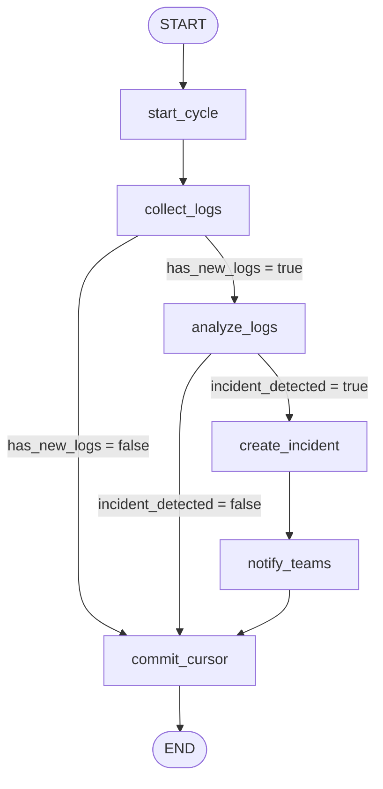
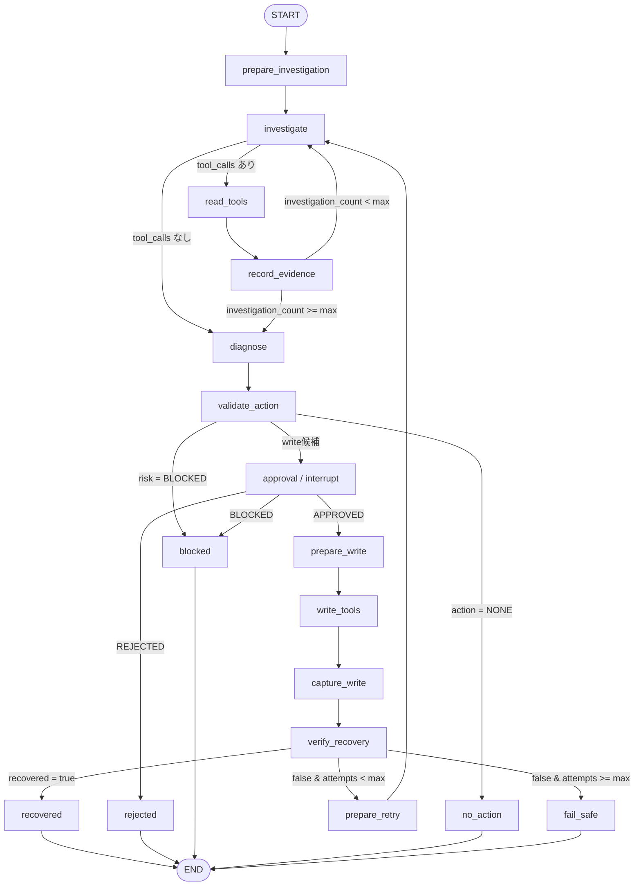
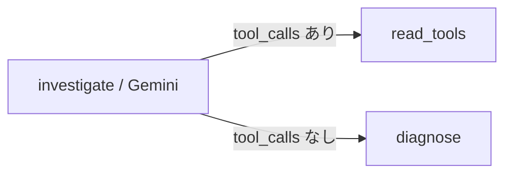
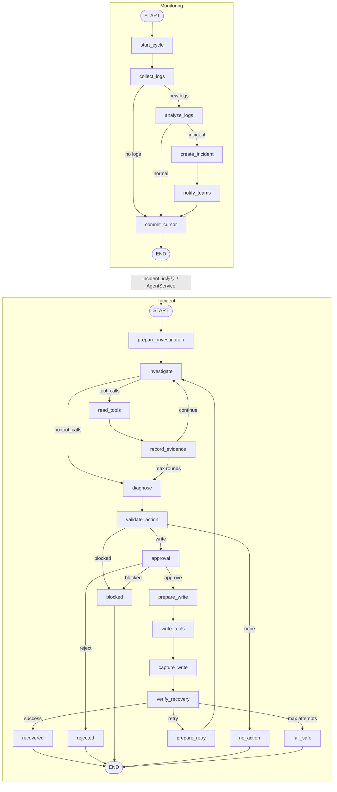

# LangGraph Node / Edge Flow

この資料は、`jboss-agent-prod` の LangGraph について、**Node と Edge の接続・分岐条件だけ**を確認するための簡易図である。

State の項目、各 Node の詳細処理、`thread_id` / Checkpointer / MCP の説明は [`LANGGRAPH_STATE_FLOW.md`](./LANGGRAPH_STATE_FLOW.md) を参照。

---

## 1. Monitoring Graph

実装: `src/jboss_agent/graphs/monitoring.py`



### Conditional Edge だけ抜き出すと

```text
collect_logs
  ├─ has_new_logs = true  -> analyze_logs
  └─ has_new_logs = false -> commit_cursor

analyze_logs
  ├─ incident_detected = true  -> create_incident
  └─ incident_detected = false -> commit_cursor
```

`has_new_logs` は Python がログ差分から決める。

`incident_detected` は `analyze_logs` 内で **Gemini がログ分類した結果**を State に格納し、その値を Conditional Edge が参照する。

つまり `analyze_logs` 後の分岐は、**LLM の判断結果を Python の Edge が読み取って分岐する箇所**である。

---

## 2. Incident Graph

実装: `src/jboss_agent/graphs/incident.py`



### Conditional Edge だけ抜き出すと

```text
investigate
  ├─ tool_calls あり -> read_tools
  └─ tool_calls なし -> diagnose

record_evidence
  ├─ investigation_count < max  -> investigate
  └─ investigation_count >= max -> diagnose

validate_action
  ├─ risk = BLOCKED -> blocked
  ├─ action = NONE  -> no_action
  └─ write候補      -> approval

approval
  ├─ APPROVED -> prepare_write
  ├─ REJECTED -> rejected
  └─ BLOCKED  -> blocked

verify_recovery
  ├─ recovered = true             -> recovered
  ├─ false & recovery_attempts < max  -> prepare_retry
  └─ false & recovery_attempts >= max -> fail_safe
```

### LLM が実質的に分岐を決める場所

特に重要なのは次の Edge である。



Gemini が `AIMessage.tool_calls` を返した場合は追加調査へ進み、返さなかった場合は診断へ進む。

したがって、ここでは **「追加の Tool 調査を続けるか、診断へ進むか」について LLM の出力が Graph の進行方向を実質的に決めている**。

また、`analyze_logs` 後の `incident_detected` 分岐も LLM の分類結果に依存する。

一方、以下は Python / Human が決定する。

```text
record_evidence 後の調査回数上限   -> Python
validate_action 後の Risk Policy   -> Python
approval 後の承認・拒否            -> Human + Python
verify_recovery 後の復旧成否        -> Python
```

---

## 3. 2つの Graph を最小構成で並べる



> Monitoring Graph の `END` と Incident Graph の `START` は LangGraph の Edge で直接つながっているわけではない。`AgentService.run_scan()` が Monitoring の戻り値に `incident_id` がある場合だけ Incident Graph を起動する。
