# LangGraph State / 状態遷移 / 実行順序 詳細

> この文書は「何をすると、どの Node が呼ばれ、State のどの値が変わり、次にどこへ進むか」を追跡するための資料である。  
> システム全体の詳細設計は [`DETAILED_DESIGN.md`](./DETAILED_DESIGN.md) を参照。

---

## 1. まず理解するべきこと

このアプリケーションには LangGraph が 2 本ある。

1. **Monitoring Graph**  
   `server.log` の差分を監視し、障害を検知する。

2. **Incident Graph**  
   検知された障害を調査し、診断し、人間の承認後に復旧操作を行う。

重要なのは、ここでいう State は「画面の状態」や「Python Thread の状態」そのものではないことである。

```text
LangGraph State
  = Graph の Node 間で引き継ぐ業務データ
  + SQLite Checkpointer に保存され、同じ thread_id で復元できる実行状態
```

`RuntimeStore` に保存する UI 用 Incident Status とは別物である。

---

## 2. State / Node / Edge / thread_id の関係

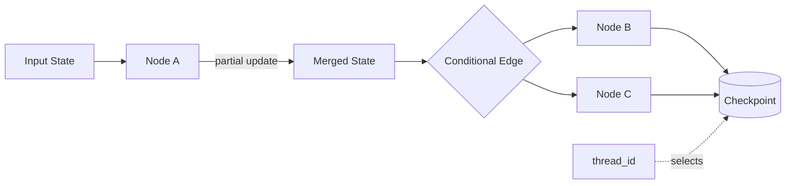

各 Node は State 全体を作り直すのではなく、原則として**更新するキーだけを dict で返す**。

例:

```python
return {
    "incident_detected": True,
    "category": "THREAD_POOL",
    "confidence": 0.95,
}
```

reducer を持たないキーは新しい値で上書きされる。

`IncidentState.messages` だけは `add_messages` reducer が設定されており、新しい Message を返すと既存履歴へ統合される。

---

# Part A. Monitoring Graph

## 3. MonitoringState

定義: `src/jboss_agent/graphs/state.py`

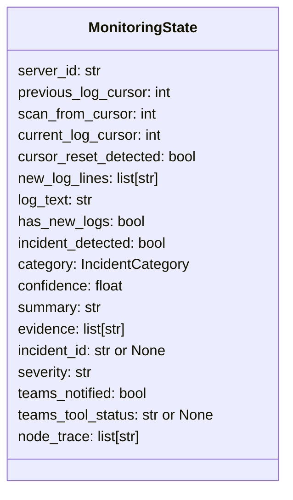

### 3.1 State 項目の意味

| Key | 生成 / 更新する主な Node | 意味 |
|---|---|---|
| `server_id` | Graph 入力 | 監視対象 Server |
| `previous_log_cursor` | `commit_cursor` | 次回 Scan の開始 byte offset |
| `scan_from_cursor` | `collect_logs` | 今回実際に読み始めた位置 |
| `current_log_cursor` | `collect_logs` | 今回読み終えた位置 |
| `cursor_reset_detected` | `collect_logs` | ログ縮小により 0 から再読したか |
| `new_log_lines` | `collect_logs` | 今回のログ差分 |
| `log_text` | `collect_logs` | Gemini に渡す結合済みログ |
| `has_new_logs` | `collect_logs` | 差分の有無 |
| `incident_detected` | `analyze_logs` | Gemini の障害判定 |
| `category` | `analyze_logs` | NORMAL / THREAD_POOL / DATASOURCE_POOL / DEPLOYMENT / UNKNOWN |
| `confidence` | `analyze_logs` | 0.0〜1.0 |
| `summary` | `analyze_logs` | 分類結果の要約 |
| `evidence` | `analyze_logs` | ログ分類の根拠 |
| `incident_id` | `create_incident` | 検知時に発行される ID |
| `severity` | `create_incident` | HIGH / MEDIUM |
| `teams_notified` | `notify_teams` | Teams Tool の成功フラグ |
| `teams_tool_status` | `notify_teams` | dry_run / sent / duplicate_skipped 等 |
| `node_trace` | 各 Node | 通過 Node の追跡 |

---

## 4. Monitoring Graph 状態遷移図

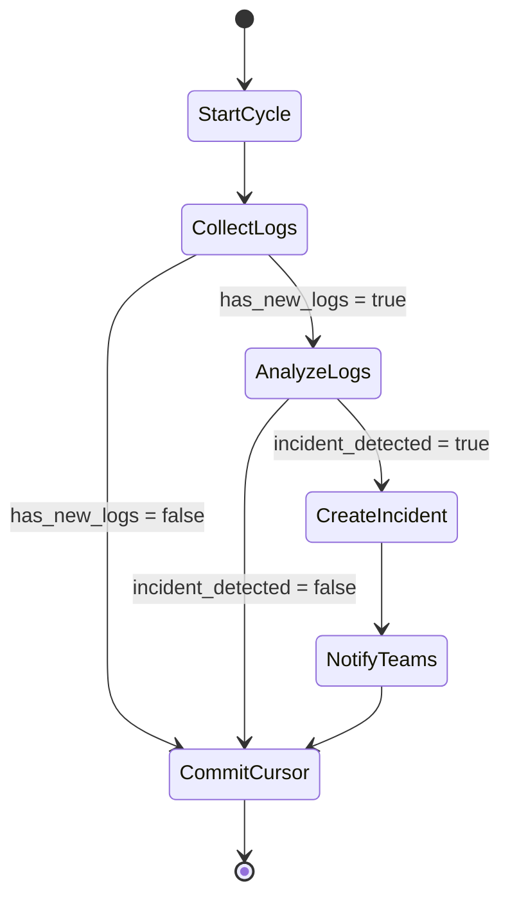

これは Node の遷移図である。

業務状態として見ると、より簡略化して次のように表せる。

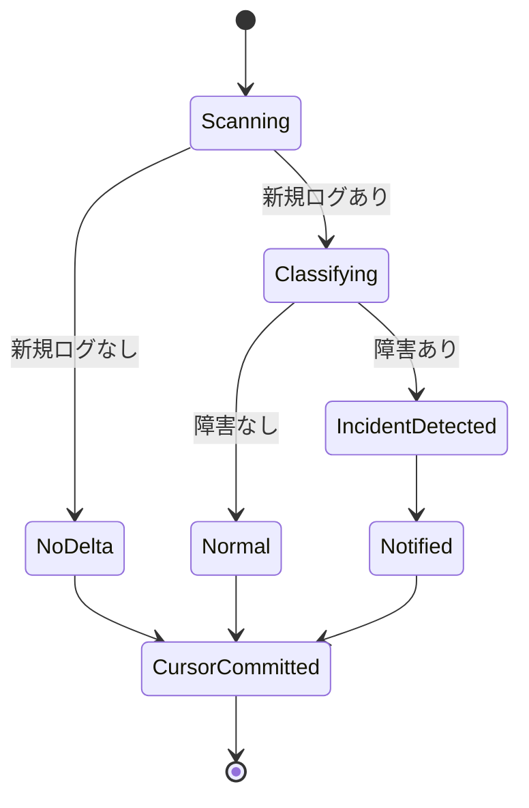

---

## 5. Monitoring Graph: Node ごとの State 更新

### 5.1 START → `start_cycle`

Graph Input:

```python
{"server_id": "jboss-01"}
```

ただし固定 `thread_id=monitor:jboss-01` の Checkpoint が既に存在する場合、前回 State が復元される。

`start_cycle` は前サイクルの一時結果をリセットする。

主な更新:

```text
new_log_lines      = []
has_new_logs       = False
incident_detected  = False
category           = NORMAL
confidence         = 0.0
summary            = No new logs
evidence           = []
incident_id        = None
severity           = LOW
teams_notified     = False
teams_tool_status  = None
node_trace         = [start_cycle]
```

一方、以下は維持される。

```text
server_id
previous_log_cursor
```

### 5.2 `start_cycle` → `collect_logs`

`collect_logs` は:

```python
read_server_log(
    server_id=state["server_id"],
    cursor=state.get("previous_log_cursor", 0),
)
```

を実行する。

正常時の更新例:

```text
previous_log_cursor = 1000  # 前回から保持
scan_from_cursor     = 1000
current_log_cursor   = 1450
new_log_lines        = [...]
log_text             = "...\n..."
has_new_logs         = True
cursor_reset_detected= False
```

ログ差分が 0 行なら:

```text
scan_from_cursor   = 1450
current_log_cursor = 1450
new_log_lines      = []
has_new_logs       = False
```

### 5.3 cursor reset

保存済み cursor が現在の `server.log` サイズより大きい場合、Fake JBoss は:

```text
cursor ... is beyond current log size ...
```

という Error を返す。

このケースに限り `collect_logs` は一度だけ cursor `0` で読み直す。

結果:

```text
scan_from_cursor      = 0
cursor_reset_detected = True
```

### 5.4 `collect_logs` 後の分岐

関数:

```text
_route_after_collect
```

条件:

| `has_new_logs` | 次 Node |
|---|---|
| `False` | `commit_cursor` |
| `True` | `analyze_logs` |

ここが **Gemini Skip** の分岐である。

### 5.5 `analyze_logs`

Gemini Structured Output:

```python
LogClassification(
    incident_detected=...,
    category=...,
    confidence=...,
    summary=...,
    evidence=...,
)
```

State へ同じ値を反映する。

### 5.6 `analyze_logs` 後の分岐

関数:

```text
_route_after_analysis
```

| `incident_detected` | 次 Node |
|---|---|
| `False` | `commit_cursor` |
| `True` | `create_incident` |

### 5.7 `create_incident`

生成:

```text
incident_id = inc-xxxxxxxxxx
```

Severity:

```text
category != UNKNOWN and confidence >= 0.85
    -> HIGH
otherwise
    -> MEDIUM
```

### 5.8 `notify_teams`

State の Incident 情報を Teams Tool へ渡す。

更新:

```text
teams_notified
teams_tool_status
```

### 5.9 `commit_cursor`

最後に:

```text
previous_log_cursor = current_log_cursor
```

を確定する。

これにより次回同じ Monitoring `thread_id` で Scan した際、同じログを再処理しない。

---

## 6. Monitoring の具体例

### 6.1 初回 Scan

入力:

```text
server_id = jboss-01
checkpoint = なし
```

遷移:

```text
START
 -> start_cycle
 -> collect_logs(cursor=0)
 -> analyze_logs
 -> normal or incident
 -> commit_cursor
 -> END
```

### 6.2 2 回目、ログ追加なし

Checkpoint:

```text
previous_log_cursor = 850
```

遷移:

```text
START
 -> start_cycle
 -> collect_logs(cursor=850)
      has_new_logs=False
 -> commit_cursor
 -> END
```

`analyze_logs` が通らないため Gemini 呼び出しは 0 回。

### 6.3 障害ログ追加あり

```text
previous_log_cursor = 850
new server.log end  = 1240
```

遷移:

```text
collect_logs
 -> analyze_logs
 -> create_incident
 -> notify_teams
 -> commit_cursor
 -> END
```

Monitoring Graph 自体はここで終了する。

その戻り値の `incident_id` を見て、`AgentService` が別の Incident Graph を開始する。

---

# Part B. Monitoring から Incident への切り替え

## 7. Graph 間の接続は Edge ではない

Monitoring Graph と Incident Graph は LangGraph 上で直接 Edge 接続されていない。

接続するのは `AgentService.run_scan()` である。

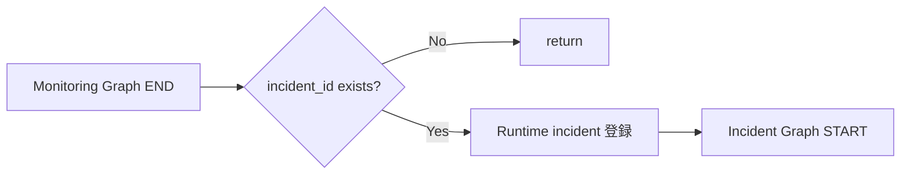

Monitoring Graph 結果:

```python
monitoring["incident_id"]
```

が存在した場合、Service が:

```text
thread_id = incident:<incident_id>
```

を生成し、新しい Incident Graph を呼ぶ。

---

# Part C. Incident Graph

## 8. IncidentState

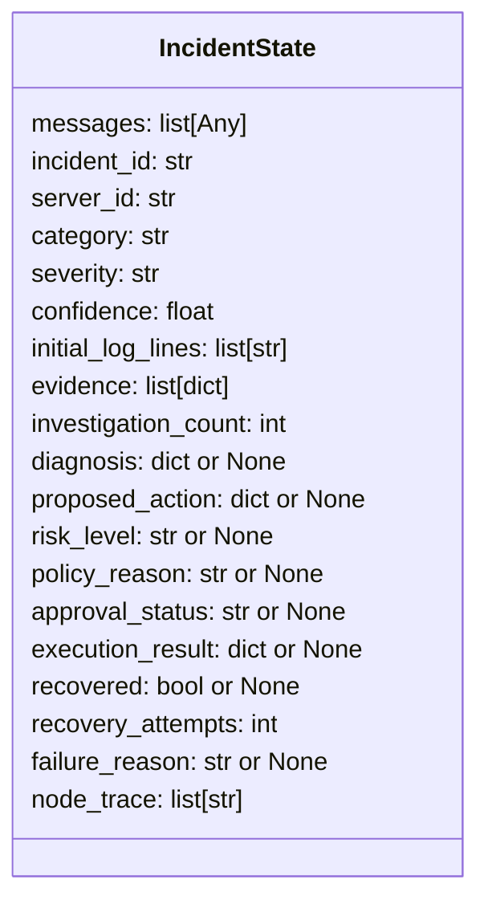

### 8.1 reducer

`messages`:

```python
Annotated[list[Any], add_messages]
```

そのため Node が:

```python
{"messages": [response]}
```

だけを返しても過去の Message は消えずに統合される。

`evidence` や `node_trace` には reducer がないため、Node 自身が:

```python
[*state.get("evidence", []), new_item]
```

のように既存値を含めて返す必要がある。

---

## 9. Incident Graph 全状態遷移

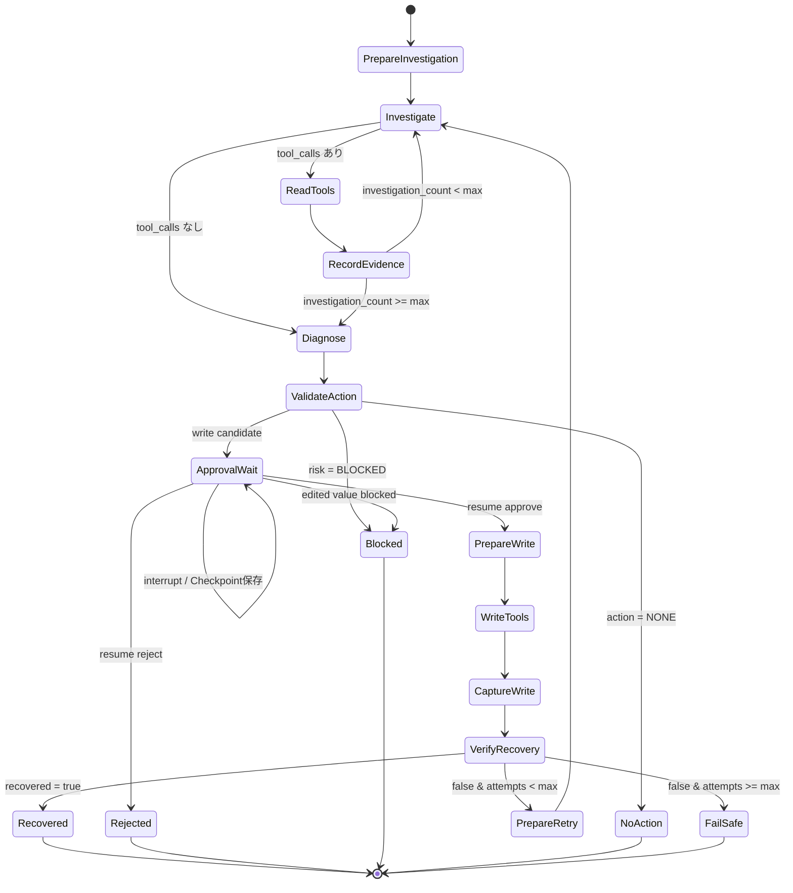

---

## 10. Incident 初期 State

Monitoring から Incident Graph を開始するとき、Service は以下を渡す。

```python
{
    "incident_id": incident_id,
    "server_id": server_id,
    "category": monitoring["category"],
    "severity": monitoring["severity"],
    "confidence": monitoring["confidence"],
    "initial_log_lines": monitoring["new_log_lines"],
    "messages": [],
    "evidence": [],
    "investigation_count": 0,
    "recovery_attempts": 0,
    "node_trace": [],
}
```

まだ存在しない値:

```text
diagnosis
proposed_action
risk_level
policy_reason
approval_status
execution_result
recovered
failure_reason
```

`IncidentState` は `total=False` なので、途中段階で未生成のキーがあってもよい。

---

## 11. Incident Node 詳細

### 11.1 `prepare_investigation`

初回で `messages` が空なら:

- SystemMessage: read-only 調査方針
- HumanMessage: Incident ID / Server / category hint / severity / initial logs

を生成する。

State:

```text
messages              += initial messages
evidence               = []
investigation_count    = 0
recovery_attempts      = 0
node_trace             += prepare_investigation
```

再開時など既に messages がある場合は初期 Message を重複追加しない。

### 11.2 `investigate`

```python
response = investigator.invoke(state["messages"])
```

Gemini は read Tool Call を含む `AIMessage`、または Tool Call なしの結論 Message を返す。

State:

```text
messages             += AIMessage
investigation_count  += 1
node_trace            += investigate
```

### 11.3 `investigate` 後の分岐

```text
最後の AIMessage に tool_calls があるか？
```

| 条件 | 次 Node |
|---|---|
| あり | `read_tools` |
| なし | `diagnose` |

### 11.4 `read_tools`

LangGraph の `ToolNode(list(read_tools))`。

Gemini が要求した read-only Tool を実行し、結果を `ToolMessage` として `messages` に追加する。

例:

```text
AIMessage
  tool_call: get_thread_pool_status
        ↓
ToolNode
        ↓
ToolMessage
  {max_threads:20, queue_size:37, ...}
```

### 11.5 `record_evidence`

`messages` の末尾に連続している ToolMessage だけを抜き出し、`evidence` へ追加する。

保存形式:

```python
{
    "tool_name": ...,
    "tool_call_id": ...,
    "content": ...,
}
```

過去の ToolMessage を毎回再追加しないよう、直近の連続 ToolMessage だけを見る。

### 11.6 調査 Round 分岐

`investigation_count >= max_investigation_rounds` の場合:

```text
record_evidence -> diagnose
```

未満:

```text
record_evidence -> investigate
```

Gemini 自身が Tool Call をやめた場合は上限未到達でも即 `diagnose` へ進む。

---

## 12. 診断から Policy まで

### 12.1 `diagnose`

入力:

- `initial_log_lines`
- `evidence`

Gemini Structured Output:

```python
IncidentDiagnosis
```

更新:

```text
diagnosis       = result.model_dump()
proposed_action = recommended_action.model_dump()
```

### 12.2 `validate_action`

`evaluate_action(proposed_action)` を呼ぶ。

更新:

```text
proposed_action = normalized_action
risk_level      = LOW / MEDIUM / HIGH / BLOCKED
policy_reason   = reason
```

さらに:

```text
allowed and risk != LOW
    -> approval_status = PENDING
otherwise
    -> approval_status = None
```

### 12.3 Policy 後の分岐

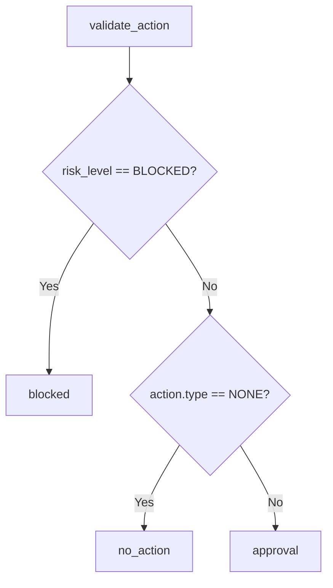

---

## 13. `interrupt()` で何が起きるか

### 13.1 `approval` Node に入る

Node は State から承認画面用 Payload を作る。

その後:

```python
raw = interrupt(payload)
```

を実行する。

この瞬間、通常の関数呼び出しのように「その場で人間の入力を待ち続ける」のではない。

概念的には:

```text
approval node
   ↓
interrupt(payload)
   ↓
Checkpoint SQLite に実行状態保存
   ↓
Graph invocation 終了
   ↓
result["__interrupt__"] を caller に返す
```

### 13.2 Runtime DB

Service は `__interrupt__` の Payload を取り出し:

```text
Incident.status = PENDING_APPROVAL
pending_approval_json = payload
```

として `runtime.sqlite` に保存する。

UI は Runtime DB を読むため、Streamlit が再実行されても承認画面を復元できる。

---

## 14. `thread_id` と Checkpoint の役割

### 14.1 Monitoring

```text
monitor:jboss-01
```

目的:

```text
前回 cursor を次回 Scan へ引き継ぐ
```

### 14.2 Incident

```text
incident:inc-xxxxxxxxxx
```

目的:

```text
その Incident 固有の messages / evidence / diagnosis / interrupt 状態を保存する
```

### 14.3 Python Thread との違い

誤解しやすいが:

```text
LangGraph thread_id != OS thread != Python threading.Thread
```

承認待ち中に 1 Incident につき 1 Python Thread が占有されるわけではない。

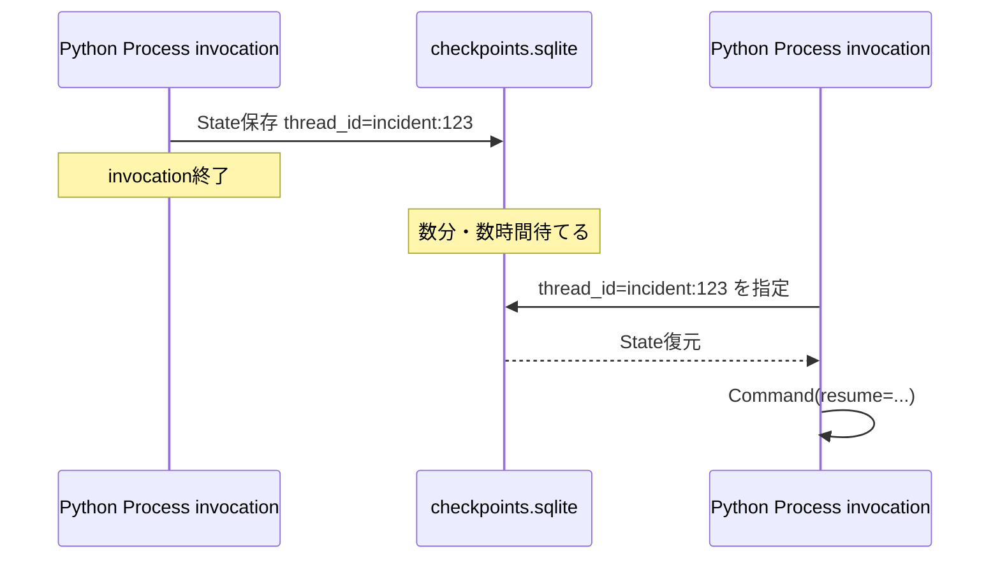

---

## 15. 承認操作ごとの State 遷移

### 15.1 Approve

UI:

```python
resume_incident(
    incident_id,
    decision="approve",
)
```

Service:

```python
Command(resume={"decision": "approve"})
```

`approval` Node 再開後:

```text
approval_status = APPROVED
```

次:

```text
prepare_write
```

### 15.2 Reject

```text
approval_status = REJECTED
```

次:

```text
rejected
```

`rejected`:

```text
failure_reason = 提案された変更は人によって拒否されました。
```

write Tool は呼ばれない。

### 15.3 Edit & Approve

Resume:

```python
{
    "decision": "edit_and_approve",
    "proposed_value": 80,
}
```

処理:

```text
proposed_action.proposed_value を編集
    ↓
evaluate_action() を再実行
```

許可:

```text
approval_status = APPROVED
```

範囲外など:

```text
risk_level      = BLOCKED
approval_status = BLOCKED
policy_reason   = ...
```

---

## 16. write 実行前に State を再検証する理由

承認が通った後も `_write_call()` は再度:

```text
approval_status == APPROVED ?
Policy allowed ?
risk != BLOCKED ?
```

を確認する。

つまり経路上で一度許可されたという事実だけに依存しない。

その後 Action Type から Python が write Tool を決定する。

---

## 17. write 実行時の Message 変化

### 17.1 `prepare_write`

Graph の ToolNode を利用するため、Python が決めた Tool Call を AIMessage に変換する。

例:

```python
AIMessage(
    content="",
    tool_calls=[{
        "name": "set_thread_pool_max_threads",
        "args": {"server_id": "jboss-01", "value": 80},
        "id": "write-...",
        "type": "tool_call",
    }],
)
```

この Message が `messages` に追加される。

### 17.2 `write_tools`

write 専用 ToolNode が実行し、ToolMessage を追加する。

### 17.3 `capture_write`

直前 Message が ToolMessage であることを検証し:

```text
execution_result = {
    tool_name,
    tool_call_id,
    content
}
recovery_attempts += 1
```

とする。

この時点ではまだ:

```text
recovered = True
```

にはしない。

---

## 18. Recovery Verification

`verify_recovery` は read Tool を再度呼ぶ。

### 18.1 共通判定

```text
server.status == UP
AND
request_error_rate < 0.05
```

### 18.2 Thread Pool Action

```text
active_threads <= max_threads
queue_size == 0
rejected_tasks == 0
```

### 18.3 Datasource Action

```text
active_count <= max_pool_size
timed_out_requests == 0
```

### 18.4 Deployment Restart

```text
status == OK
enabled == True
```

結果:

```text
recovered = True / False
```

さらに取得した Metrics を:

```text
evidence += recovery_verification
```

として残す。

---

## 19. 復旧失敗時の Retry

分岐:

```text
recovered == True
    -> recovered

recovered != True and recovery_attempts >= max_recovery_attempts
    -> fail_safe

otherwise
    -> prepare_retry
```

### 19.1 `prepare_retry` がクリアする State

```text
investigation_count = 0
diagnosis            = None
proposed_action      = None
risk_level           = None
policy_reason        = None
approval_status      = None
execution_result     = None
recovered            = None
```

維持するもの:

```text
messages
initial logs
evidence
recovery_attempts
incident_id
server_id
```

さらに Message:

```text
The approved remediation did not recover the server.
Re-investigate ... challenge the previous diagnosis.
```

を追加する。

つまり、過去の調査履歴を残しつつ、診断と承認はやり直す。

---

## 20. Terminal State

### 20.1 `recovered`

```text
recovered = True
```

復旧確認成功。

### 20.2 `no_action`

Action `NONE` の場合:

```text
recovered = True
```

とし、「変更なしで正常完了」と扱う。

ただしこの経路では write も Metrics による recovery verification も行わない。

### 20.3 `rejected`

```text
approval_status = REJECTED
failure_reason   = 人による拒否
```

### 20.4 `blocked`

```text
approval_status = BLOCKED
failure_reason   = policy_reason
```

### 20.5 `fail_safe`

```text
recovered      = False
failure_reason = 復旧試行回数の上限に達しました...
```

---

## 21. Incident Graph の Node 更新一覧

| Node | 主に読む State | 主に更新する State |
|---|---|---|
| `prepare_investigation` | `messages`, initial fields | `messages`, `evidence`, counters, `node_trace` |
| `investigate` | `messages` | `messages`, `investigation_count`, `node_trace` |
| `read_tools` | last AI tool calls | `messages` |
| `record_evidence` | `messages`, `evidence` | `evidence`, `node_trace` |
| `diagnose` | initial logs, `evidence` | `diagnosis`, `proposed_action`, `node_trace` |
| `validate_action` | `proposed_action` | normalized action, `risk_level`, `policy_reason`, `approval_status` |
| `approval` | action, diagnosis, risk | `approval_status`, optional edited action |
| `prepare_write` | approved action | `messages`, `node_trace` |
| `write_tools` | last write Tool Call | `messages` |
| `capture_write` | last ToolMessage | `execution_result`, `recovery_attempts` |
| `verify_recovery` | action, server id | `recovered`, `evidence` |
| `prepare_retry` | prior State | reset diagnosis/approval fields, add retry message |
| `recovered` | - | `node_trace` |
| `rejected` | - | `failure_reason`, `node_trace` |
| `blocked` | `policy_reason` | `approval_status`, `failure_reason`, `node_trace` |
| `no_action` | - | `recovered=True`, `node_trace` |
| `fail_safe` | - | `recovered=False`, `failure_reason`, `node_trace` |

---

## 22. Conditional Edge 一覧

| 直前 Node | Route 関数 / 条件 | 遷移先 |
|---|---|---|
| Monitoring `collect_logs` | `has_new_logs` | `analyze_logs` / `commit_cursor` |
| Monitoring `analyze_logs` | `incident_detected` | `create_incident` / `commit_cursor` |
| Incident `investigate` | last AIMessage has `tool_calls` | `read_tools` / `diagnose` |
| Incident `record_evidence` | `investigation_count >= max` | `diagnose` / `investigate` |
| Incident `validate_action` | BLOCKED / NONE / write candidate | `blocked` / `no_action` / `approval` |
| Incident `approval` | APPROVED / REJECTED / other | `prepare_write` / `rejected` / `blocked` |
| Incident `verify_recovery` | recovered / attempts | `recovered` / `prepare_retry` / `fail_safe` |

---

## 23. node_trace の例

### 23.1 正常ログ

```text
start_cycle
collect_logs
analyze_logs
commit_cursor
```

### 23.2 Incident -> 承認待ち

Monitoring:

```text
start_cycle
collect_logs
analyze_logs
create_incident
notify_teams
commit_cursor
```

Incident:

```text
prepare_investigation
investigate
record_evidence
investigate
... 
diagnose
validate_action
```

`approval` は `interrupt()` より後で Trace を返す実装なので、**最初に停止した時点では `approval` がまだ `node_trace` に追加されていない場合がある**。再開後、承認結果を処理した際に追加される。

### 23.3 Approve -> Recovery

```text
...
approval
prepare_write
capture_write
verify_recovery
recovered
```

ToolNode 自身は `node_trace` を更新していないため、`read_tools` / `write_tools` は Trace 名として直接は追加されない。

---

## 24. 代表シナリオ別の流れ

### 24.1 `NORMAL_ACTIVITY`

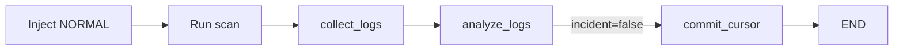

Incident Graph は起動しない。

### 24.2 `THREAD_POOL_CONFIGURATION`

典型例:

```text
ログ:
  queue growth
  task rejected
  503 increase

調査:
  get_thread_pool_status
  get_recent_config_changes
  get_server_health

診断:
  THREAD_POOL_CONFIGURATION

提案:
  SET_THREAD_POOL_MAX_THREADS
  20 -> 80

Policy:
  80 は 1..200 -> MEDIUM / Allowed

Human:
  Approve

Write:
  set_thread_pool_max_threads(80)

Verify:
  queue=0
  rejected=0
  error_rate<5%

Result:
  RECOVERED
```

### 24.3 `DATASOURCE_POOL_EXHAUSTION`

典型的な Action:

```text
SET_DATASOURCE_MAX_POOL_SIZE
```

復旧確認:

```text
active_count <= max_pool_size
timed_out_requests == 0
```

### 24.4 `DEPLOYMENT_FAILURE`

典型的な Action:

```text
RESTART_DEPLOYMENT
```

Risk:

```text
HIGH
```

復旧確認:

```text
deployment.status == OK
deployment.enabled == True
server health OK
```

---

## 25. Runtime Status への変換

LangGraph の State と UI の Incident Status は同一ではない。

`AgentService._persist_incident()` が変換する。

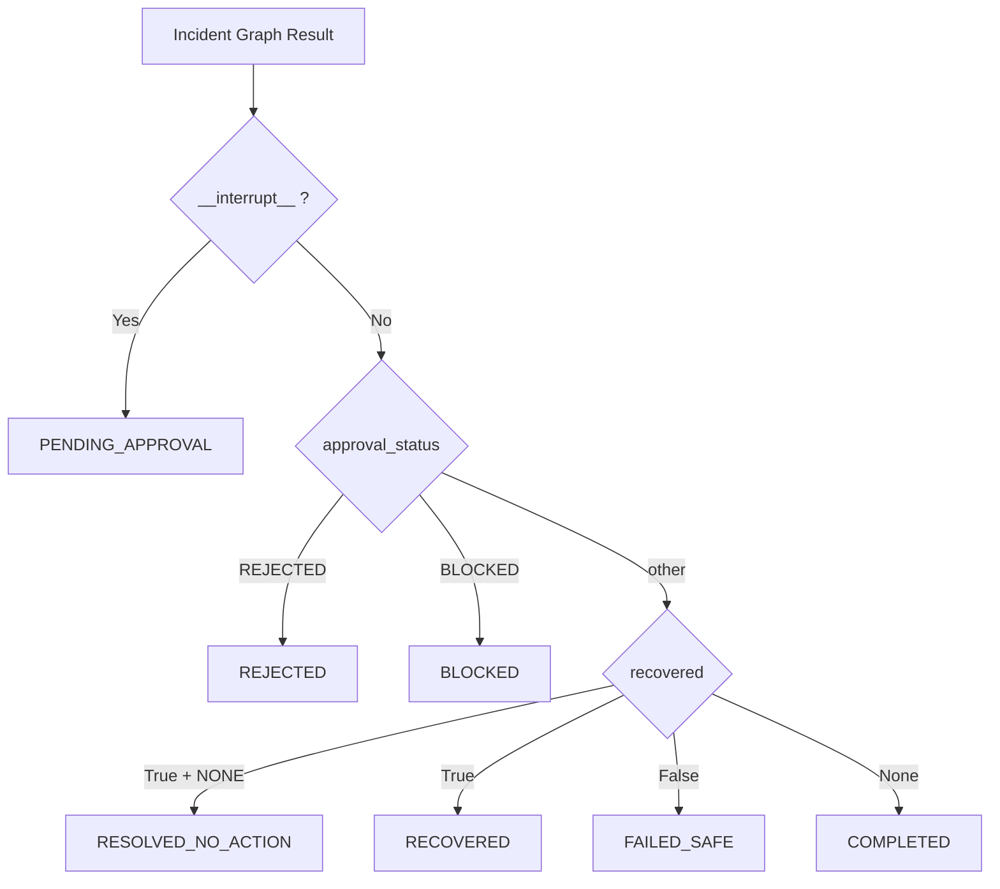

この Status は `runtime.sqlite` に保存され、Streamlit が表示する。

---

## 26. Checkpoint DB と Runtime DB の使い分け

### Checkpoint DB

保存するもの:

```text
Graph の内部 State
Graph の実行位置
interrupt の継続情報
messages
cursor
```

目的:

```text
正確に Graph を継続する
```

### Runtime DB

保存するもの:

```text
画面表示用 Status
Incident summary
pending approval payload
diagnosis
proposed action
activity timeline
thread_id
```

目的:

```text
UI で検索・一覧表示する
```

Runtime DB の `pending_approval` だけでは Graph は再開できない。

再開には:

```text
Runtime DB の thread_id
+
Checkpoint DB の実 State
```

が必要である。

---

## 27. 「何をすると何が起こるか」操作対応表

| ユーザー操作 | 呼ばれる主要処理 | Graph / State の結果 |
|---|---|---|
| `Inject Random Event` | `FaultInjector.inject_random()` | Fake JBoss の state/log 変更。LangGraph はまだ動かない |
| `Inject selected scenario` | `FaultInjector.inject()` | 同上 |
| `Run scan now` | `AgentService.run_scan()` | Monitoring Graph 実行 |
| 新規ログなし | `collect_logs -> commit_cursor` | Gemini Skip、Incident なし |
| 正常ログ | `analyze_logs -> commit_cursor` | Incident なし |
| 障害ログ | `create_incident -> notify_teams` | Service が Incident Graph 開始 |
| 調査で Tool Call | `investigate -> read_tools -> record_evidence` | evidence 増加 |
| 調査終了 | `diagnose` | diagnosis / proposed_action 生成 |
| 安全でない提案 | `validate_action -> blocked` | BLOCKED |
| Action NONE | `validate_action -> no_action` | recovered=True / no write |
| 書き込み候補 | `approval -> interrupt` | PENDING_APPROVAL |
| `承認して実行` | `Command(resume=approve)` | approval -> write -> verify |
| `拒否する` | `Command(resume=reject)` | REJECTED / no write |
| `編集した値で承認` | `Command(resume=edit_and_approve)` | Policy 再検証後 write または BLOCKED |
| write 後 Healthy | `verify_recovery -> recovered` | RECOVERED |
| write 後 Unhealthy | `prepare_retry` | 再調査へ戻る |
| 再試行上限 | `fail_safe` | FAILED_SAFE |

---

## 28. 実装を読むおすすめ順

State 遷移を理解する目的なら次の順番が追いやすい。

```text
1. graphs/state.py
   ↓ State に何があるか

2. graphs/monitoring.py
   ↓ 最初の短い Graph

3. service.py run_scan()
   ↓ Monitoring と Incident の接続

4. graphs/incident.py
   ↓ Tool loop / conditional edge / interrupt / retry

5. policy.py
   ↓ LLM と Python 制御の境界

6. mcp/client.py + mcp/server.py
   ↓ read/write capability の境界

7. persistence.py
   ↓ thread_id がどう永続化されるか

8. runtime_store.py
   ↓ Graph State と UI Status が別物であること

9. app.py
   ↓ Human-in-the-loop が UI からどう resume されるか
```

---

## 29. この実装から学べる LangGraph の主要概念

### StateGraph

Node が共有する State の型と Graph 構造を定義する。

### Node

State を入力として受け、State の部分更新を返す処理単位。

### Edge

必ず次へ進む固定遷移。

### Conditional Edge

State の値を見て次 Node を選ぶ。

### ToolNode

AIMessage の Tool Call を実 Tool 実行へ接続する LangGraph の組み込み Node。

### reducer

複数の Node 更新をどう State に統合するかを定義する。ここでは `messages` の `add_messages` が代表例。

### Checkpointer

State と実行位置を外部へ保存し、同じ `thread_id` で復元する。

### `interrupt()`

Graph を安全に停止し、外部入力を待つための仕組み。

### `Command(resume=...)`

保存された Interrupt へ外部入力を渡し、Graph を再開する。

---

## 30. まとめ

このプロジェクトの State 遷移を一文で表すと:

```text
Monitoring State で「前回どこまでログを読んだか」を継続し、
障害を見つけたら Incident ごとの State を新規作成し、
read-only 調査の履歴を messages/evidence に積み、
診断後は Python Policy で書き込み可否を決め、
interrupt で State を SQLite に退避して人の判断を待ち、
同じ thread_id へ resume して承認済み write を実行し、
実測値で復旧を確認し、必要なら再調査する。
```

LangGraph が担当している本質は「長時間 Thread を保持すること」ではなく、**状態と遷移を明示し、その途中状態を Checkpoint して後から正確に続きを実行できるようにすること**である。
