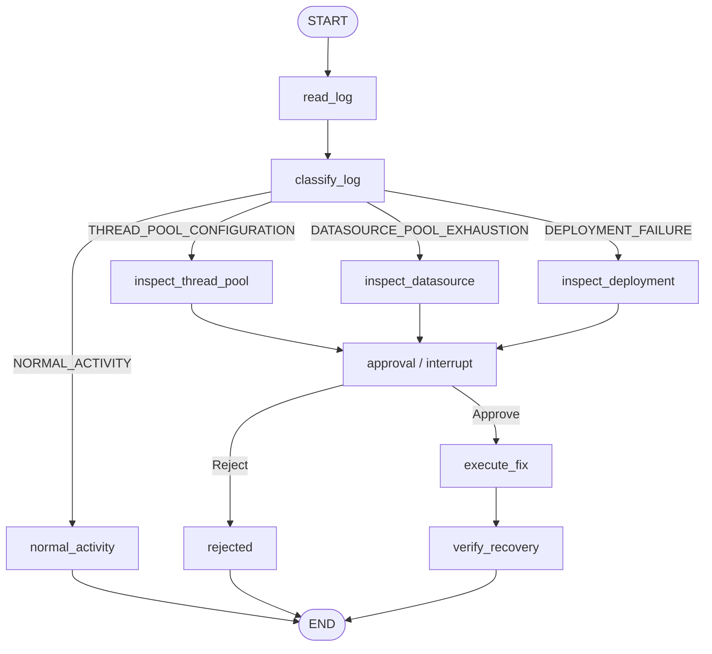

# LangGraph / MCP / Human-in-the-loop 学習ガイド

この文書は `README.md` より 1 段コード寄りに、**何をすると State がどう変わり、次にどの Node が呼ばれるか**を説明します。

## 1. 1 回の実行フロー



## 2. Node ごとの State 変化

### 初期 State

`app.py` は Graph を次の程度の State で開始します。

```python
{
    "server_id": "jboss-01",
    "trace": [],
}
```

### `read_log`

MCP:

```text
read_server_log(server_id="jboss-01")
```

更新:

```python
{
    "log_lines": [...],
    "trace": ["read_log"],
}
```

### `classify_log`

Gemini に `log_lines` を渡します。

例:

```python
{
    "category": "THREAD_POOL_CONFIGURATION",
    "summary": "worker queue and rejected tasks are visible",
    "trace": ["read_log", "classify_log"],
}
```

ここで重要なのは、**LLM が Node 名を直接返しているわけではない**ことです。
LLM は業務上の意味である `category` を返します。

その後 `route_category(state)` が:

```python
return state["category"]
```

を行い、Conditional Edge の mapping が Node を決めます。

### `inspect_thread_pool`

MCP:

```text
get_thread_pool_status
```

更新例:

```python
{
    "evidence": {
        "max_threads": 20,
        "active_threads": 20,
        "queue_size": 37,
    },
    "proposed_action": {
        "tool": "set_thread_pool_max_threads",
        "args": {"server_id": "jboss-01", "value": 80},
        "description": "thread pool の max_threads を 80 に戻す",
    },
    "trace": [..., "inspect_thread_pool"],
}
```

Datasource / Deployment も同じ構造です。

### `approval`

`interrupt(payload)` を呼ぶため、**初回は Node が return しません**。

画面側には:

```python
result["__interrupt__"]
```

が返ります。

Checkpoint には `approval` に到達する直前までの State が保存されます。

Approve の場合:

```python
graph.ainvoke(
    Command(resume=True),
    config={"configurable": {"thread_id": same_thread_id}},
)
```

再開すると `interrupt()` の戻り値が `True` になり、初めて Node が:

```python
{
    "approved": True,
    "trace": [..., "approval"],
}
```

を返します。

### `execute_fix`

`approved is True` を確認してから、`proposed_action` の write MCP Tool を呼びます。

Thread Pool の例:

```text
set_thread_pool_max_threads(server_id="jboss-01", value=80)
```

更新:

```python
{
    "execution_result": {...},
    "trace": [..., "execute_fix"],
}
```

### `verify_recovery`

もう一度 read MCP Tool を呼びます。

```python
{
    "recovered": True,
    "status": "RECOVERED",
    "trace": [..., "verify_recovery"],
}
```

そして END です。

---

## 3. 具体例: Thread Pool 障害

### ① シナリオ投入

Fake JBoss:

```text
max_threads = 20
active_threads = 20
queue_size = 37
```

ログ:

```text
WARN HTTP worker queue is growing
ERROR task rejected from worker executor
WARN HTTP 503 responses increased
```

### ② Graph 開始

```text
START
 ↓
read_log
```

State:

```python
server_id = "jboss-01"
log_lines = [...]
```

### ③ Gemini 分類

```text
classify_log
```

State:

```python
category = "THREAD_POOL_CONFIGURATION"
```

### ④ Conditional Edge

```text
THREAD_POOL_CONFIGURATION
          ↓
inspect_thread_pool
```

この部分が **LLM の判断結果によって Graph の実行経路が変わるところ**です。

### ⑤ MCP read

```text
get_thread_pool_status
```

State に evidence と proposed_action が増えます。

### ⑥ HITL

```text
approval
  ↓
interrupt()
```

ここで Python 処理は終了してよく、Checkpointer が再開地点を覚えます。

### ⑦ Approve

```text
Command(resume=True)
```

同じ `thread_id` を使います。

### ⑧ MCP write

```text
set_thread_pool_max_threads(80)
```

### ⑨ MCP read で確認

```text
get_thread_pool_status
```

```text
max_threads = 80
queue_size = 0
```

### ⑩ END

```python
status = "RECOVERED"
```

---

## 4. なぜ InMemorySaver なのか

HITL では Checkpointer 自体は必要です。

しかし今回必要なのは:

```text
interrupt で止まる
  ↓
Approve ボタンを押す
  ↓
同じ thread_id で再開する
```

という **Checkpoint の概念を理解すること**だけです。

そのため:

```python
InMemorySaver()
```

で十分です。

SQLite にすると、次の学習テーマが一気に増えます。

- DB ファイル lifecycle
- cursor 永続化
- Incident ID
- Streamlit 再起動後の復元
- 複数 thread の管理
- stale checkpoint の扱い

これらは「永続化を学ぶ Step」で追加すればよく、最初の LangGraph 学習には不要です。

---

## 5. MCP と普通の Python 関数の違いをこのコードで見る

シナリオ投入は UI が直接:

```python
fake.inject(...)
```

を呼びます。

一方 Agent が JBoss を調査するときは:

```text
LangGraph Node
  ↓
LangChain MCP Tool
  ↓ stdio
MCP Server
  ↓
FakeJBoss method
```

です。

つまり「同じ FakeJBoss のメソッドを使っていても、Agent から見える能力は MCP Server が公開した Tool だけ」という境界を確認できます。

---

## 6. 割り切っている点

これは意図的な教材上の簡略化です。

- 1 user
- 1 server
- 1 incident at a time
- 1 run
- in-memory checkpoint
- no authentication
- no production audit log
- no monitoring scheduler
- no retry
- fixed remediation values
- no LLM-generated write arguments
- Fake JBoss behavior is simplified

これらの制約によって、`graph.py` を上から読めば処理全体を追える状態を優先しています。
