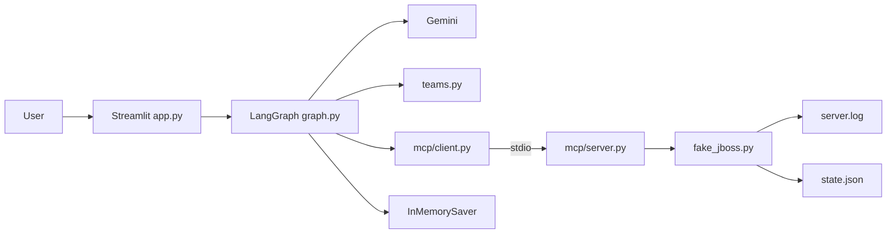
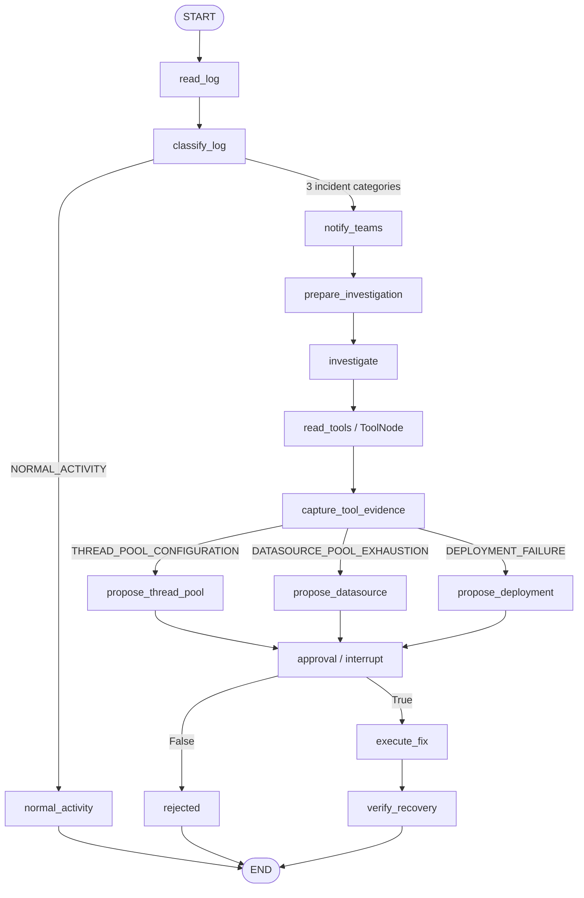
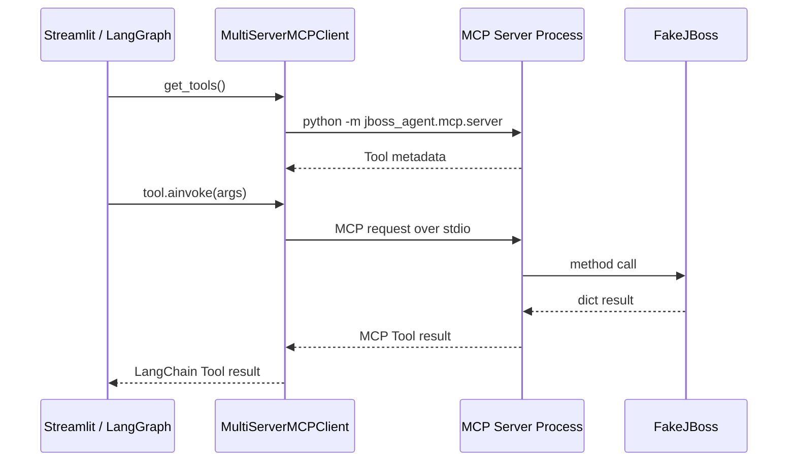

# JBoss Incident Response Agent 詳細設計・処理フロー

この文書は、`jboss-agent-prod` の主要コンポーネント、LangGraph の Node / Edge、State 遷移、MCP Tool、ToolNode、Human-in-the-loop、Teams 通知の関係を実装に近い粒度で説明します。

## 1. システム構成



### コンポーネント責務

| ファイル | 責務 |
|---|---|
| `app.py` | UI、Graph 開始/再開、Approve / Reject、State 表示 |
| `graph.py` | State、Node、Edge、Gemini、ToolNode、HITL の構成 |
| `mcp/client.py` | MCP Server 起動、Tool 取得、read/write 分離 |
| `mcp/server.py` | Fake JBoss 操作を MCP Tool として公開 |
| `fake_jboss.py` | 疑似ログ・疑似 JBoss 状態・障害投入 |
| `teams.py` | Teams Webhook 送信 |
| `config.py` | Gemini / Teams / Fake JBoss 設定 |

---

## 2. Graph 定義



Graph は 1 本だけです。正常系と障害系は `classify_log` 後の Conditional Edge で分かれます。

---

## 3. AgentState

```text
AgentState
├─ server_id
├─ log_lines
├─ category
├─ summary
├─ messages
├─ selected_read_tools
├─ evidence
├─ teams_result
├─ proposed_action
├─ approved
├─ execution_result
├─ recovered
├─ status
└─ trace
```

### `messages`

`messages` は `add_messages` reducer を持ちます。

```python
messages: Annotated[list[Any], add_messages]
```

ToolNode は LangGraph / LangChain の標準 message 形式を利用するため、この State に次が順番に追加されます。

```text
HumanMessage
   ↓
AIMessage(tool_calls=[...])
   ↓
ToolMessage
```

### `trace`

`trace` は教材用の単純な Node 通過履歴です。

Thread Pool 障害を Approve した場合の例:

```text
read_log
→ classify_log
→ notify_teams
→ prepare_investigation
→ investigate
→ read_tools
→ propose_thread_pool
→ approval
→ execute_fix
→ verify_recovery
```

---

## 4. Node 詳細

| Node | 主な入力 | 処理 | 主な更新 |
|---|---|---|---|
| `read_log` | `server_id` | MCP `read_server_log` | `log_lines` |
| `classify_log` | `log_lines` | Gemini Structured Output | `category`, `summary` |
| `notify_teams` | `server_id`, `category`, `summary` | Teams 通知 | `teams_result` |
| `prepare_investigation` | category / log | 調査依頼を作成 | `messages` |
| `investigate` | `messages` | Gemini が read Tool を選択 | `AIMessage` |
| `read_tools` | AIMessage Tool Call | `ToolNode` が MCP Tool 実行 | `ToolMessage` |
| `capture_tool_evidence` | ToolMessage | Tool 結果を辞書化 | `selected_read_tools`, `evidence` |
| `propose_*` | category | 固定対処案を作成 | `proposed_action` |
| `approval` | proposed action | `interrupt()` | resume 後 `approved` |
| `execute_fix` | approved/action | MCP write Tool 実行 | `execution_result` |
| `verify_recovery` | category | MCP read Tool で確認 | `recovered`, `status` |
| `rejected` | approval=False | 書込せず終了 | `status=REJECTED` |
| `normal_activity` | category=NORMAL | 何も変更せず終了 | `status=NO_INCIDENT` |

---

## 5. ログ分類

`read_log` は MCP の `read_server_log` を固定で呼びます。

```text
LangGraph
  ↓
MCP Client
  ↓ stdio
MCP Server
  ↓
FakeJBoss.read_server_log()
```

取得したログを `classify_log` が Gemini へ渡します。

Gemini の出力は `LogAnalysis` の JSON Schema で制約します。

```python
class LogAnalysis(BaseModel):
    category: Category
    summary: str
```

`category` は次の 4 値だけです。

```text
THREAD_POOL_CONFIGURATION
DATASOURCE_POOL_EXHAUSTION
DEPLOYMENT_FAILURE
NORMAL_ACTIVITY
```

正常なら `normal_activity` へ進みます。障害なら `notify_teams` へ進みます。

---

## 6. Teams 通知

`notify_teams` は通常の LangGraph Node です。

```text
classify_log
   ↓ incident
notify_teams
   ↓
teams.py
   ↓
Microsoft Teams Webhook
```

MCP 経由ではありません。

これは JBoss の Capability と Teams 通知を別の連携として扱うためです。

State に次のような結果が残ります。

```python
{
    "success": True,
    "status": "dry_run",
    "payload": {
        "text": "[JBoss Incident Detected] ..."
    }
}
```

既定では `TEAMS_DRY_RUN=true` です。

---

## 7. Gemini による read Tool 選択

### 7.1 bind する Tool

`build_investigator()` は read Tool のうち、詳細調査用の 3 Tool だけを Gemini に bind します。

```text
get_thread_pool_status
get_datasource_status
get_deployment_status
```

`read_server_log` はすでに入口 Node で実行済みなので bind 対象から外します。

write Tool は一切 bind しません。

```python
model.bind_tools(diagnostic_tools, tool_choice="any")
```

`tool_choice="any"` により、調査 Node では Tool Call を要求します。Prompt では「最も適切な 1 Tool だけ選ぶ」よう指示します。

### 7.2 Message の流れ

`prepare_investigation` が `HumanMessage` を作ります。

例:

```text
Server: jboss-01
Category: THREAD_POOL_CONFIGURATION
server.log: ...
Choose exactly ONE bound read-only tool...
```

`investigate` が Gemini を呼ぶと、例えば次の `AIMessage` が返ります。

```python
AIMessage(
    tool_calls=[
        {
            "name": "get_thread_pool_status",
            "args": {"server_id": "jboss-01"}
        }
    ]
)
```

この時点では Tool はまだ実行されていません。

---

## 8. ToolNode の動作

`read_tools` Node は LangGraph の `ToolNode` です。

```python
graph.add_node("read_tools", ToolNode(diagnostic_tools))
```

ToolNode は最新の `AIMessage.tool_calls` を読み、名前が一致する Tool を実行します。

Thread Pool の例:

```text
AIMessage
 tool_calls:
   get_thread_pool_status(server_id="jboss-01")
       ↓
ToolNode
       ↓
LangChain MCP Tool
       ↓
stdio MCP Server
       ↓
FakeJBoss.get_thread_pool_status()
       ↓
ToolMessage
```

`capture_tool_evidence` が ToolMessage を辞書へ変換し、State に保存します。

```python
selected_read_tools = ["get_thread_pool_status"]

evidence = {
    "get_thread_pool_status": {
        "max_threads": 20,
        "active_threads": 20,
        "queue_size": 37
    }
}
```

この構成では LLM が **何を調べるか** を選び、ToolNode が **その Tool Call を実行する** 役割です。

---

## 9. category と対処案

ToolNode の実行後、`category` に応じて Conditional Edge で 3 Node に分かれます。

```text
THREAD_POOL_CONFIGURATION
  → propose_thread_pool

DATASOURCE_POOL_EXHAUSTION
  → propose_datasource

DEPLOYMENT_FAILURE
  → propose_deployment
```

対処内容は固定です。

| Category | write Tool | Args |
|---|---|---|
| Thread Pool | `set_thread_pool_max_threads` | `value=80` |
| Datasource | `set_datasource_max_pool_size` | `value=30` |
| Deployment | `restart_deployment` | `deployment_name=app.war` |

LLM は write Tool 名や write 引数を生成しません。

---

## 10. Human-in-the-loop

`approval` Node は `interrupt()` を実行します。

```python
decision = interrupt({...})
```

初回 Graph 実行では、この Node は return せず中断します。

```text
... → propose_thread_pool
          ↓
       approval
          ↓
      interrupt
          ↓
Graph returns __interrupt__
```

Checkpoint には再開に必要な State が保存されます。

Streamlit で Approve を押すと:

```python
Command(resume=True)
```

を同じ `thread_id` で渡します。

```text
same Checkpointer
same thread_id
Command(resume=True)
        ↓
approval resumes
        ↓
execute_fix
```

Reject の場合は `rejected` へ進み、MCP write Tool は実行されません。

---

## 11. write Tool と復旧確認

`execute_fix` は `approved is True` を確認します。

その後 `proposed_action` の Tool 名を、あらかじめ取得済みの write Tool 集合から検索して直接実行します。

```text
execute_fix
   ↓
MCP write Tool
   ↓
Fake JBoss state change
```

その後 `verify_recovery` が read Tool を直接呼びます。

### Thread Pool

```text
max_threads >= 80
queue_size == 0
```

### Datasource

```text
max_pool_size >= 30
timed_out_requests == 0
```

### Deployment

```text
status == OK
```

成功なら:

```python
status = "RECOVERED"
recovered = True
```

となります。

---

## 12. 具体的な状態遷移例

Thread Pool 障害で Gemini が `get_thread_pool_status` を選び、人が Approve した場合です。

### Initial

```python
{
    "server_id": "jboss-01",
    "trace": []
}
```

### read_log

```python
log_lines = [
    "WARN HTTP worker queue is growing",
    "ERROR task rejected from worker executor",
    ...
]
```

### classify_log

```python
category = "THREAD_POOL_CONFIGURATION"
summary = "worker queue and rejected tasks indicate thread pool pressure"
```

### notify_teams

```python
teams_result = {
    "success": True,
    "status": "dry_run"
}
```

### investigate

```python
messages = [
    HumanMessage(...),
    AIMessage(tool_calls=[get_thread_pool_status])
]
```

### read_tools / ToolNode

```python
messages += [ToolMessage(...)]
selected_read_tools = ["get_thread_pool_status"]
```

### propose_thread_pool

```python
proposed_action = {
    "tool": "set_thread_pool_max_threads",
    "args": {
        "server_id": "jboss-01",
        "value": 80
    }
}
```

### approval

```text
interrupt → Approve
```

### execute_fix

```text
set_thread_pool_max_threads(value=80)
```

### verify_recovery

```python
recovered = True
status = "RECOVERED"
```

---

## 13. プロセス境界

Streamlit / LangGraph と MCP Server は別プロセスです。



両プロセスは `.data/fake_jboss/state.json` と `server.log` を通して同じ Fake JBoss 状態を参照します。

---

## 14. 設定

`.env` の主要項目:

| Key | 内容 |
|---|---|
| `GOOGLE_API_KEY` | Gemini API Key |
| `GEMINI_MODEL` | Gemini model |
| `TEAMS_DRY_RUN` | Teams を実送信しない場合 `true` |
| `TEAMS_WEBHOOK_URL` | Teams Webhook URL |
| `SERVER_ID` | Fake server ID |
| `FAKE_JBOSS_DATA_DIR` | 疑似状態保存先 |

MCP Server 子プロセスには Fake JBoss に必要な `SERVER_ID` と `FAKE_JBOSS_DATA_DIR` だけを明示的に渡します。

---

## 15. テスト観点

`tests/test_graph.py` では、実 Gemini の代わりに Stub を利用し、次を確認します。

- category ごとの分岐
- Gemini が選んだ Tool 名を ToolNode が実行すること
- 選ばれていない read Tool は呼ばれないこと
- Teams Node が障害時だけ実行されること
- `interrupt()` 前に write が発生しないこと
- Approve 後に write が実行されること
- Reject では write が実行されないこと
- 正常系が Teams / ToolNode / HITL を通らないこと

`tests/test_mcp.py` では実際に stdio MCP Server を起動して read / write Tool の往復を確認します。

`tests/test_teams.py` では dry-run と Webhook URL 未設定時の動作を確認します。

GitHub Actions では `ruff check .` と `pytest -q` を実行します。

---

## 16. デモとしての前提

このアプリは JBoss 障害対応の業務ロジックを忠実に再現することより、Agent の構造を分かりやすく確認できることを優先しています。

- 1 user
- 1 Fake JBoss server
- 1 incident at a time
- Checkpoint は memory only
- 監視 scheduler なし
- 認証 / RBAC なし
- retry loop なし
- write の値は固定
- Fake JBoss の復旧挙動は単純化

一方で、LLM / ToolNode / MCP / Teams / Human approval の境界は実装上明示的に分けています。
